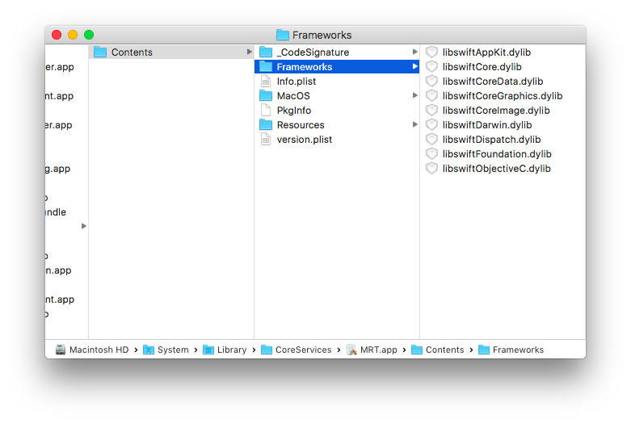

[Original Link](https://blog.timac.org/2020/0927-state-of-swift-ios14/)

# Apple’s use of Swift and SwiftUI in iOS 14
## Introduction
Detect 1 binary có sử dụng swift hay không

## Giới thiệu
Nội dung bài blog tác giả đề cập đến các kỹ thuật để kiểm tra xem 1 binary có sử dụng Swift hay không

## Cách cũ
Check xem có chứa swift libraries trong thư mục frameworks của app payload hay không?
Thường sẽ là các lib sau đây:
```
libswiftCore.dylib, libswiftFoundation.dylib, …
```


Tuy nhiên cách cũ không còn hiệu quả nữa kể từ khi Apple đưa các Swift lib vào luôn trong private frameworks (___/System/Library/PrivateFrameworks/Swift/___). 
Một vài iOS và Mac app link trực tiếp đến các lbirary này.


## Command line tool
Tác giả giới thiệu otool như 1 giải pháp khác.
```sh
otool -L /System/Library/CoreServices/PIPAgent.app/Contents/MacOS/PIPAgent | grep swift
```
Chạy script trên iOS 10.1 (14B72c) của iPhone 7 plus
```sh
/Applications/Calculator.app/Calculator
/Applications/Music.app/Music
/Applications/Music.app/PlugIns/MusicMessagesApp.appex/MusicMessagesApp
/Applications/Music.app/PlugIns/RecentlyPlayedTodayExtension.appex/RecentlyPlayedTodayExtension
/System/Library/PrivateFrameworks/UpNextWidget.framework/PlugIns/UpNext.appex/UpNext
```
