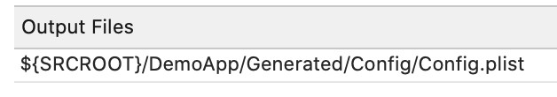

[Original Link](https://medium.com/better-programming/how-to-create-development-staging-and-production-configs-in-xcode-ec58b2cc1df4)

# Dev/Staging/Prod Configs in Xcode
## Introduction
Một project thường sẽ có nhiều environment: Dev, Staging, Product

## Cách cũ
Tạo ra từng target cho từng environment


#### Nhược điểm: 
1. file project.pbxproj bị double length và file project càng lớn càng làm chậm XCode
2. Merge conflicts in trong project file cần được resolve ở nhiều chỗ
3. Quên add file mới vào cả 2 target

## Cách tốt hơn
Sử dụng project-level configuration.
```sh
Edit scheme -> Run -> Info tab -> Build Configuration: Debug, Release hoặc Staging
```


Tạo ra các file xcconfig cho từng configuration: 
```sh
Project Settings -> Info
```

Ví dụ file xcconfig có chứa 2 biến như sau:
```sh
XCC_BUNDLE_NAME = Demo D
XCC_CONFIG_PATH = Development/Config.plist
```

2 biến này có thể được dùng trong info.plist hoặc trong build settings hoặc build phase.

## Tạo thêm run script trong build phase
Ta tạo ra thêm 1 run script trong phase sẽ sử dụng biến __XCC_CONFIG_PATH__ để chỉ copy đúng cái file config.plist của environment được chọn vào project thay vì copy tất cả (vì có thể file configure của các environment khác product có thể chứa thông tin nhạy cảm nên ta không muốn đưa nó vào release bundle)
```sh
cp -fp  “$(SRCROOT)/DemoApp/Resources/$(XCC_CONFIG_PATH)”
	“$(SRCROOT)/DemoApp/GENERATED/Config/Config.plist”
```


Lưu ý: file ___“$(SRCROOT)/DemoApp/GENERATED/Config/Config.plist”___ đã được add vào target rồi, đoạn script trên chỉ là chép đè file project của môi trường đang được chọn vào đường dẫn mà đã được add vào target.

Cũng trong run script này ta có thể thêm vào ở field output files đường dẫn của file generated config để bảo đảm là nó có tồn tại ở đó thì quá trình build mới có thể tiếp tục, không thì sẽ fail



Thay vì edit scheme để change build configuration ta có thể duplicate scheme ra cho từng build configuration. 