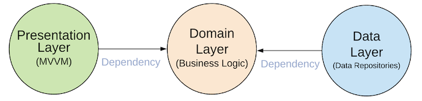
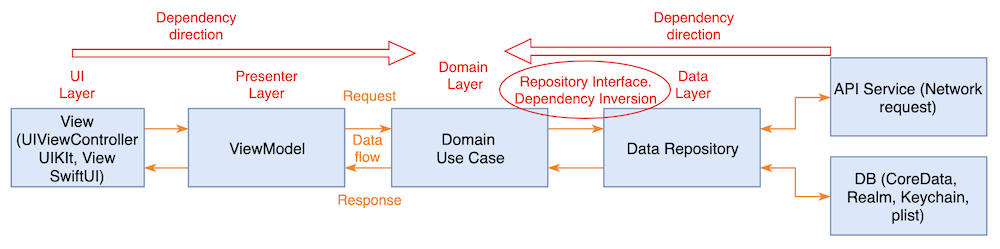

[Original Link](https://tech.olx.com/clean-architecture-and-mvvm-on-ios-c9d167d9f5b3)

# Clean Architecture and MVVM on iOS
## Introduction
Bài viết này mô tả cách tác giả apply __MVVM__ và  __Clean Architecture__ trong iOS project. Tác giả còn cung cấp project minh hoạ khá hữu ích  Đây thực sự là 1 bài blog có chất lượng tốt.

## Clean architecture

Tác giả minh hoạ bằng project Movie search.

Kiến trúc chủ yếu được chia làm 3 layer
1. MVVM và các view sẽ thuộc về __Presentation layer__.
2. __Domain layer__ sẽ chứa business logic (ở đây là search Movie).
3. __Data layer__ sẽ chịu trách nhiệm cho việc cung cấp data (fetch Movie data từ network/DB).

Hướng mũi tên minh hoạ sự depend, như ở đây ta thấy Data và Presentation sẽ phụ thuộc vào Domain. Lưu ý sự phụ thuộc ở đây không phải là kiểu inject dependency vào Domain (mặc dù thực sự là ta sẽ làm vậy để có thể inject dependency ở 2 đầu mũi tên). Sự phụ thuộc ở đây có ý nghĩa rằng 2 layer kia phải “phục vụ” cho Domain. 

Để dễ hiểu ta có thể nghĩ như sau: Domain qui định ra các protocol hoặc entities trong Domain layer. 2 layer kia hoặc là sẽ phải implement các protocol đó hoặc là sẽ phải dùng đến các entity được định nghĩa trong Domain. 

Điều này có nghĩa rằng Domain hoàn toàn độc lập và không hề biết gì về Data và Presentation từ đó ta có thể dễ dàng thay thế Presentation hoặc Data khác miễn sao nó thoả các requirement của Domain.  Nhưng ngược lại các Present và Data chỉ có thể dùng cho 1 domain cụ thể.

Từ hướng này ta có thể mở ra khả năng thay thế UIKit bằng SwiftUI 1 cách dễ dàng (vì chỉ cần thay Presentation layer).

___Presentation Layer (MVVM)___ = ViewModels(Presenters) + Views(UI)
___Domain Layer___ = Entities + Use Cases + Repositories Interfaces
___Data Repositories Layer___ = Repositories Implementations + API(Network) + Persistence DB

## Data flow
1. __View__ gọi method của __ViewModel__
2. __ViewModel__ excute __UseCase__
3. __UseCase__ kết hợp Data từ User và __Repository__
4. Mỗi __repository__ lấy data từ __remote__ hoặc __DB__
5. Thông tin trả ngược về cho __View__ để hiển thị lên

