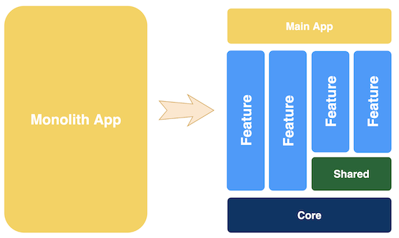
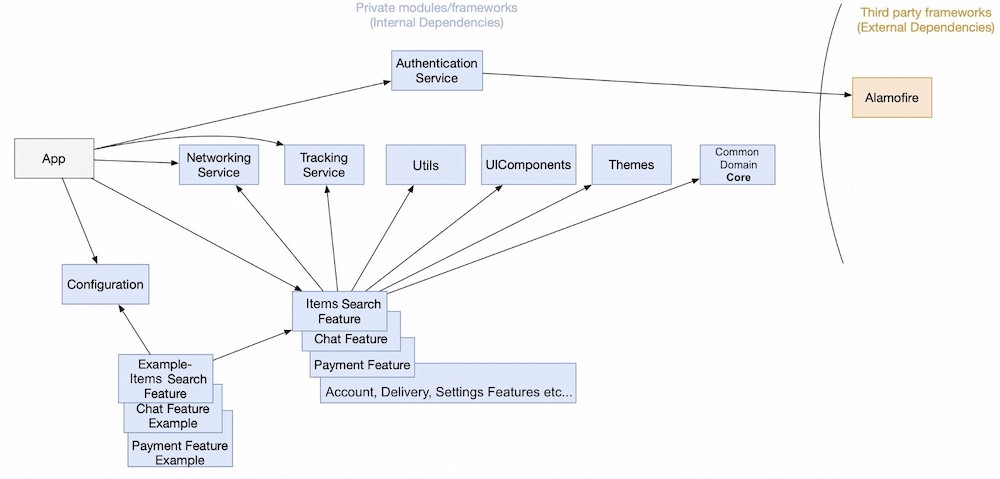
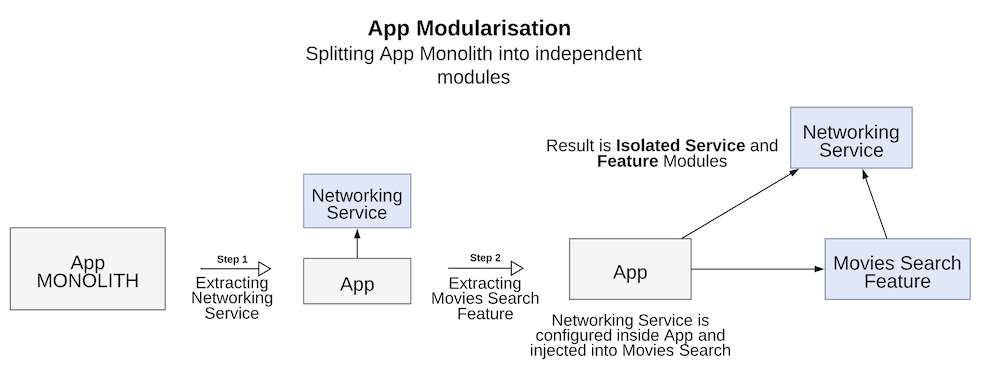

[Original Link](https://tech.olx.com/modular-architecture-in-ios-c1a1e3bff8e9?gi=b699c5e50777)

# Modular Architecture in iOS
## Introduction
Bài viết này là tiếp theo của bài viết __Clean Architecture + MVVM.__ Kiến trúc __Modular__ rất phổ biến trong Software Engineering. Khi 1 monolith App càng lớn thì nó càng trở nên ít maintanable và vì thế cần chia nó ra thành các module nhỏ hơn và độc lập.
 Trên Backend thì gọi là microservices và trên Web là microfrontends.
Bài viết này thực sự rất chất lượng và đáng để đọc.

## Isolated Modules
Ta sẽ tiến hành decouple app thành các __module riêng biệt:__ etworkingService, TrackingService, ChatFeature, PaymentFeature….

Sẽ có 3 loại module là __Core, Shared và Feature__. Feature module có sẽ depend vào Shared và Core. Dĩ nhiên ta sẽ sử dụng __Dependency Injection__ cho những chỗ bị depend.

## Search Movie
Trong project minh hoạ, tác giả minh hoạ việc tách feature Search Movie ra thành 1 module hoàn toàn riêng biệt. Thậm chí mỗi feature module còn có đi kèm 1 __example app__ cho riêng module đó mà không cần ta phải dùng đến app chính. 

Nói chung là hoàn toàn có thể build Movie Search như 1 __microapplication__.  Điều này mở ra khả năng độc lập phát triển cho team phụ trách Movie Search.

Trong project minh hoạ thì MovieSearch được tách ra như 1 framework riêng biệt và trở thành 1 __development pod__ mà ta có thể integrate vào app chính bằng cocoapods

Thậm chí team phụ trách Movie Search hoàn toàn có thể tự quyết định __Architecture__ cho riêng team mình.

