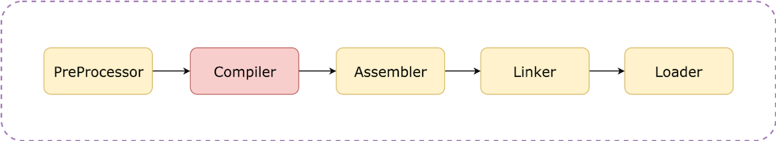

[Original Link](https://bytes.swiggy.com/advanced-techniques-to-speed-up-the-compile-time-in-xcode-27819cb3be59)

# Advanced techniques to speed up the compile time in Xcode
## Introduction
Bài viết trình bày tổng quan về quá trình build app. Trên cơ sở lý thuyết đó, ta có thể áp dụng vài kỹ thuật để làm giảm build time.

## High-level overview
Bài viết trình bày tổng quan về quá trình build app. Trên cơ sở lý thuyết đó, ta có thể áp dụng vài kỹ thuật để làm giảm build time.




Hình trên là overview của quá trình build gồm các bước: ___PreProcessor, Compiler, Assembler, Linker, Loader___
#### Preprocessor:
* Thay macros bằng definitions
* Discover dependencies
* Resolve preprocessor directives

#### Compiler:
* Convert source code thành machine code (assembly).

#### Assembler:
* Translate human-readable assembly code thành relocatable machine code.
* Cho ra các Mac-O file mà về cơ bản là 1 collection của code và data.
* Mac-O là 1 stream các byte sẽ được run trên ARM processor của iOS device hoặc Intel processor của Mac.

#### Linker:
* Merge các object files và libraries thành 1 single executable Mach-O có thể run trên iOS hoặc MacOS
* Object Files + dylib, .a , .tbd => Single Executable file

#### Loader:
Đem app lên memory và execute nó.
* Allocate memory space để run app.
* Inititialize các register về trạng thái initial.
* Load dylibs và các dynamic libraries cần thiết để run app.
* Loader time tỷ lệ thuận với App Launch Time.

## Build type
#### Clean build
Clean toàn bộ cache (derived data trong trường hợp iOS development) và build app như mới.
#### Incremental build
Khi đã có clean build, bất cứ thay đổi nào thực hiện trên nó đều sẽ được xem là incremental build.

#### Chia các kỹ thuật speed up build time thành 2 loại
1. Phân tích và setup best build settings cho project: làm 1 lần bất kể project size.
2. Swift Dependency Graph ảnh hưởng lên incremental build.

## Phase 1 - Setup Build Settings 
#### Compilation Mode
Giúp compiler định nghĩa behavior của driver và front end
* __Driver:__ chịu trách nhiệm quyết định file nào compile hoặc recompile và run các jobs để thực hiện compilation và linking.
* __Frontend jobs:__ launched by driver, running swift frontent và perform compilation, generate ra file PCH, merge các modules, vv… Đây là những jobs gánh phần lớn cost of compiling.

Có 2 type:
* __Primary file mode:__ Driver chia work phải làm cho multiple frontend và merge các kết quả khi các frontend finish. Ưu điểm là có thể giúp driver thực hiện incremental compilation bằng cách chỉ run các frontend cho những file mà nó nghĩ là đã out-date, cũng như run parallel multiple frontend jobs.
* __Whole file mode:__ run 1 frontend job duy nhất cho toàn bộ module. Đọc tất cả các file trong module và compile tất cả. Ưu điểm là có thể thực hiện vài optimaztion nào đó nhưng nhược điểm là lúc nào cũng rebuild toàn bộ.

Setup:
```
Debug Configuration — Incremental Mode, 
Release Configuration — Whole Module
```

#### Optimization Mode
Khi bật optimaztion mode, nhiều SIL và LLVM optimization được bật lên, tốn nhiều time và memory.

Có 3 type:
* __-Onone:__ không optimize
* __-Osize:__ optimize size
* __-O:__ optimize speed

#### Complex expression & Type Inference
Type inference rất hữu ích trong swift nhưng đôi khi sẽ take rất nhiều time để compiler check infered type.
Ở development mode, thường chúng ta xem 100ms trở xuống là standard time cho compiler resolve expression. Nếu vượt quá 100ms thì chúng ta nên decouple expression hoặc giúp cho compiler hiểu final type là gì.
```sh
-Xfrontend -warn-long-expression-type-checking=100
```

#### Remove DSYM file khỏi debug
Debug mode không cần phải có dsym file.
```
Debug Configuration DWARF,
Release Configuration DWARF with dSYM file
```

__DWARF:__ debugging with attributed record formats, là 1 standardized debugging data format
__DSYM:__ debug symbol, dùng để reverse symbolication of code trong crash report.

#### Run script phase
Được chạy mỗi lần compile. Có thể optimize step này để giảm build time.
```
Use Input/Output files for script phases.
```

Nếu compiler biết rằng đã generate output, nó sẽ không re-run same script again cho đến khi bạn clear derive data hoặc clean build.

## Phase 2 - Swift Dependency Graph
Compiler có Dependency Graph sẽ được dùng khi compile project. Build system biết được file hoặc module nào sẽ build trước hoặc module nào có thể parallel building.

Có 3 rule mà compiler sẽ follow bất cứ khi nào incremental build
#### Rule 1
Khi change function body của swift function, Swift Dependency Graph sẽ không build bất cứ dependent files nào. 

#### Rule 2
Khi thêm 1 hàm mới, 1 struct mới hoặc 1 extension mới trong 1 file. Swift sẽ build lại kỹ lưỡng tất cả các file depend vào file này.
Solution: Không tạo ra 1 file Utility hoặc Extension dump tất cả các utility function trong 1 class. Thay vì vậy, tách các Extensions/Utilites thành các file khác nhau.

#### Rule 3
Any change trong framework sẽ làm cho container app build lại toàn bộ file.
