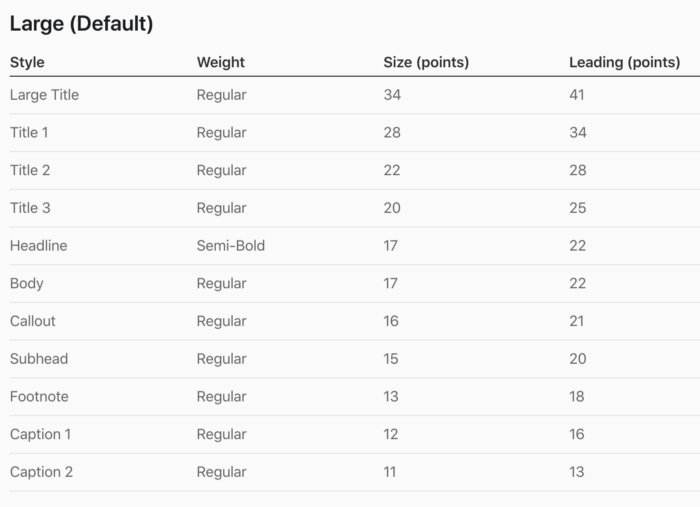

[Original Link](https://betterprogramming.pub/use-custom-font-with-dynamic-type-in-ios-apps-aeda0b314b12)

# How to Use Custom Fonts With Dynamic Type in iOS apps
## Introduction
Bài viết hướng dẫn cách dùng __Dynamic Type__ cho __Custom Font__.

## Add custom font
Hỗ trợ __True Type Font (.ttf)__ và __Open Type Font (.otf)__

## Sử dụng custom font với Dynamic Type



```swift
guard let font = UIFont(name: "Proxima Nova-Regular", size: 34) else {
    fatalError("Can't find the custom font")
}
let fontMetrics = UIFontMetrics(forTextStyle: .largeTitle)
label.font = fontMetrics.scaledFont(for: font)
```

## Update khi text size change
```swift
label.adjustsFontForContentSizeCategory = true
```
