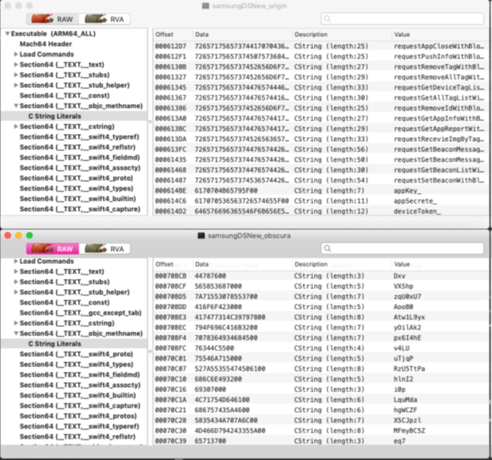

[Original Link](https://medium.com/better-programming/getting-started-with-ixguard-an-obfuscation-app-shrinking-tool-85e1342a5572)

# Getting Started With iXGuard — An Obfuscation and App Shrinking Tool
## Introduction
Bài viết giới thiệu về __iXGuard__, 1 obfuscation và app shrinking tool cho iOS

## Cài đặt iXGuard
Cho version XCode tương ứng

## Tạo ra file IPA

## Tạo ra file ixguard.yml
```sh
ixguard.yml -o [Obfuscated IPA file name] [Generated IPA file name]
```
## Apply iXGuard
```sh
config ixguard.yml -o [After obfuscation IPA] [File name] [Generated IPA file name]
```
## Obfuscation verification
Sử dụng __MachOView__



Hình trên là trước khi obfuscate, hình dưới là sau khi obfuscate.