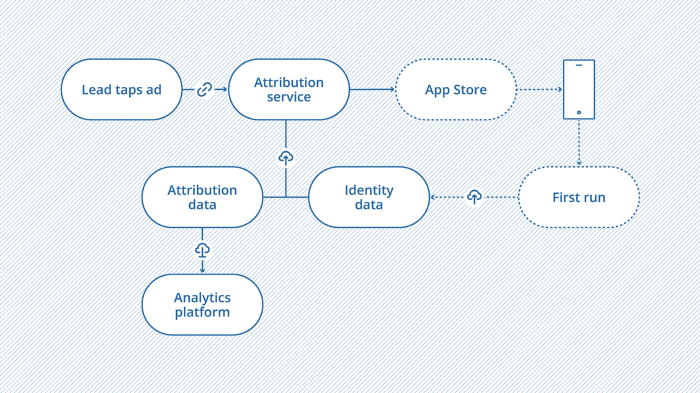

[Original Link](https://medium.com/iguanafix-engineering/an-introduction-to-app-install-attribution-on-ios-cac2259e631d)

# An introduction to app install attribution on iOS
## Introduction
Bài viết giới thiệu về cách Install App Attribution hoạt động trên iOS

## Matching Identifier

__Attribution service (Appsflyer, Adjust)__
__Ad network (Facebook, Google ad)__

Quá trình gồm 2 bước: đọc 1 vài data khi click ad và so sánh nó với vài data khác khi app run lần đầu tiên.
* Attribution service sẽ take destination URL của ad link (app page trên App Store hoặc deferred deep link).
* Attribution service sẽ tạo lại 1 cái khác với referrer data gắn trong đó. Chúng ta phải dùng URL này thay vì original.
* Khi click ad, attribution service sẽ đọc data và thực hiện transparent redirection đến ad original destination.
* Khi user install app và mở app lần đầu tiên, SDK sẽ match user với data đã được record trước đó.

## IDFA matching
Sử dụng IDFA do Apple cung cấp để làm data matching.

## Fingerprinting
Thu thập 1 vài device details chẳng hạn như IP address, screen size, OS version. Không chính xác 100%. 
Attribution Service định nghĩa 1 time limit để track conversion (thường là 24h).
