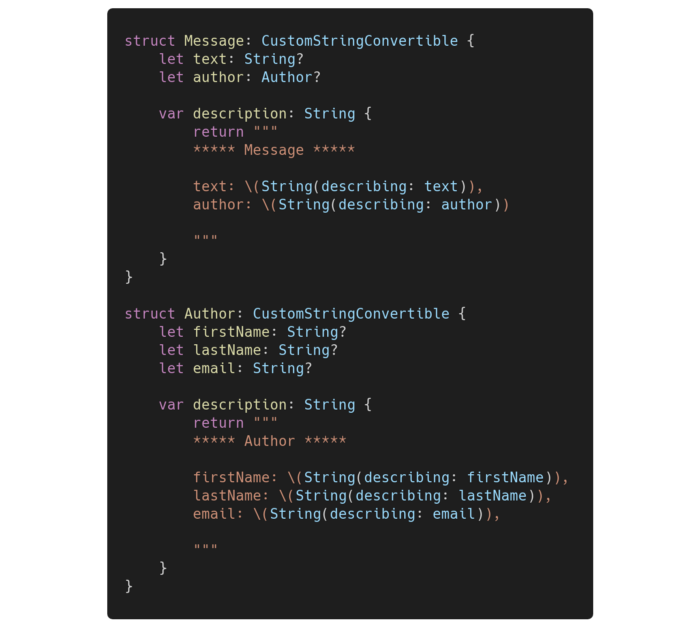
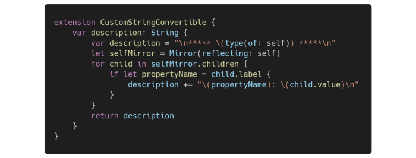

[Original Link](https://levelup.gitconnected.com/automate-debugging-swift-objects-using-the-customstringconvertible-protocol-c01fff74380f)

# Automate Debugging Swift Objects Using the CustomStringConvertible Protocol
## Introduction
Bài viết giới thiệu về cách dùng Reflection để automate print debug

## Ban đầu

## Reflection

