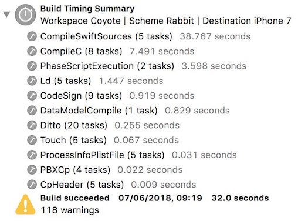
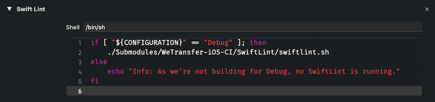
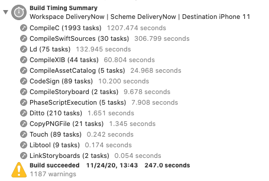

[Original Link](https://www.avanderlee.com/optimization/analysing-build-performance-xcode/)

# Build performance analysis for speeding up Xcode builds
## Introduction
Bài viết giới thiệu 1 tính năng từ XCode 10 (Build with Timing summary) và vài kỹ thuật optimizing

## Build with Timing summary
```sh
Product ➔ Perform Action ➔ Build with Timing Summary
```



## Optimizing Build Phases




## Type checking of functions and expressions
Swift Inteference 

## Build settings to speed up build performance
Config settings tương ứng cho Debug và Release
Ngoài ra:
* Chọn New build system
* Scheme settings: Parallel build

## NowApp Build Timing


