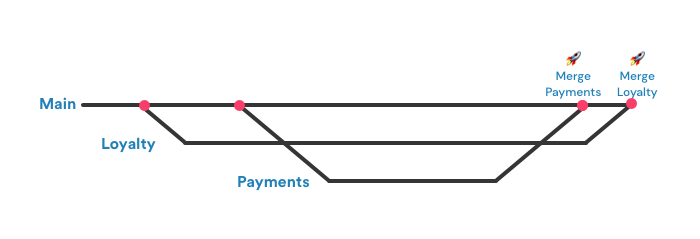
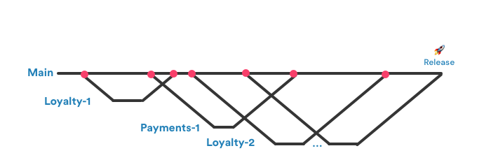
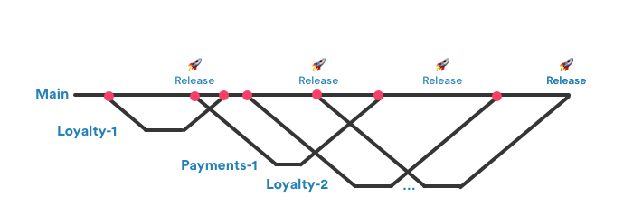

[Original Link](https://medium.com/better-programming/feature-flags-5ff6be0a4568)

# Feature Flags for iOS developers
## Introduction
Bài viết giới thiệu về cách phát triển các feature branch và merge vào main branch như thế nào cho hợp lý bằng cách kết hợp dùng thêm Feature Flag

## Option 1: Feature Branches
Đây là option thông dụng nhất, mỗi member phụ trách feature gì thì sẽ tách từ main ra thành feature branch đó và dev cho đến khi hoàn thành thì merge lại vào branch chính.

#### Nhược điểm:
* Integration test chỉ có thể thực hiện ở merge thứ 2 (Merge Loyalty)
* Payments đi sau Loyalty nên nó có thể có những additional mà Loyalty không biết
* Any hot fixes apply trên main đều có thể gây conflict cho cả Loyalty và Payments
* Nếu giả sử Payments phải delay để hotfix -> delay luôn build mà có cả 2 feature -> delay launch.

## Option 2: Short lived branches
Các small, single-task branches tách từ main ra. Những branch này sẽ không stick around bên ngoài quá lâu.

Cách này cho phép integration testing thường xuyên hơn và tránh những huge conflict.

#### Nhược điểm
* Không thể release main cho đến khi feature finishes.
* Code trong main rất không stable (đơn giản là vì chỉ chứa 1 hoặc 1 vài small single-task mà chưa finish toàn bộ feature).
* Nhiều branch nhỏ tức là nhiều conflict nhỏ.
* Theo quy trình này thì sẽ đòi hỏi nhiều lần code review —> làm chậm peer developer review.

## Option 3: Short lived branches + feature flag
Vẫn giống như option 2 nhưng sẽ dùng thêm feature flag để giải quyết các vấn đề liên quan đến việc unstable của main.
Nếu feature flag turn off, main branch sẽ work như thể là các features này không có mặc dù code của chúng dĩ nhiên là đã được merge vào main rồi và đang nằm trong main.

#### Nhược điểm
* Tuy rằng feature code không work, nhưng nó đã nằm trong main rồi và có thể gây ra vấn đề. Do đó, đòi hỏi phải thật chú ý và code review tốt để đảm bảo phần đã finished sẽ không ảnh hưởng đến main.
* Phải nhớ dọn dẹp các flag này
* Đôi khi dùng feature flag không được, ví dụ như do something trong storyboard, feature flag turn off rồi mà vẫn có thể thấy little bits of new stuff.