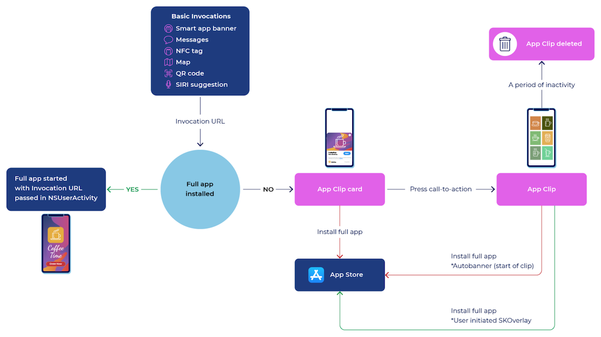
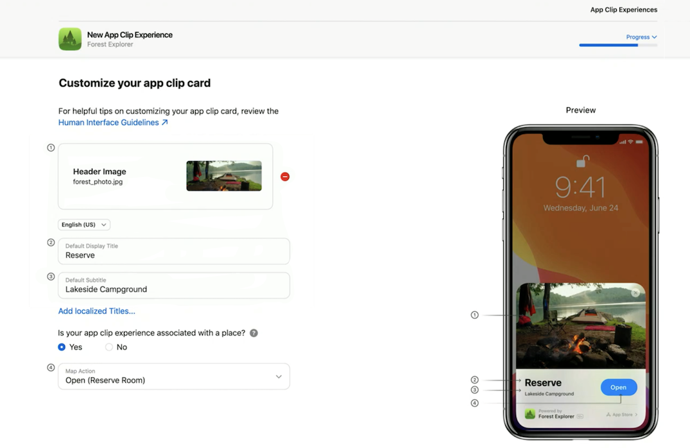

[Original Link](https://www.appsflyer.com/resources/others/apple-app-clips/)

# Apple’s iOS 14 Apps Clips
## A Definitive Guide for Developers by AppsFlyer
## Introduction
Bài viết hướng dẫn về App Clips trên iOS 14. App Clip giúp ta có thể “cài nhanh” và thực hiện 1 chức năng nhất định nào đó của app thay vì bắt user phải cài full app. 
Sau 1 khoảng thời gian không được tương tác thì app clip sẽ được tự động gỡ ra khỏi device giúp tiết kiệm bộ nhớ.

## App Clip invocation flow

App Clip sẽ start khi user interact với 1 invocation. Đối với app clip, ta sẽ có các loại Invocation sau đây:
* Smart app banner
* Messages
* NFC tag
* Map
* QR Code
* Siri suggestion

Khi được invocation, sẽ xảy ra các step sau đây.
#### 1. Invocation URL
iOS sẽ extract ra Invocation URL.

#### 2. iOS verifies Invocation URL
Tương tự như Universal Link, iOS sẽ verified Invocation URL dựa vào Apple-App-Site-Association (AASA).
Nếu Full App đã được cài đặt, app sẽ được launch và Invocation URL sẽ được truyền vào app giống như cách chúng ta xử lý Universal Link.
Lưu ý: Invocation URL sẽ không được truyền vào full app nếu user chọn cài đặt full app từ App Clip Card hoặc App Clip Banner. 
Khi đó, user phải trigger invocation lại lần nữa thì Invocation URL mới được truyền vào như mô tả ở trên.

#### 3. Hiện App Clip Card
Sau khi Invocation URL đã được verify và App chưa được cài trên máy, iOS sẽ show 1 App Clip Card lên để cho phép user hoặc là cài full app hoặc là dùng App Clip.
Mỗi App Clip Card sẽ có 1 vài mô tả ngắn để user có thể hình dung về tính năng và các permission.
Lưu ý: Mỗi App sẽ chỉ có thể có duy nhất 1 App Clip nhưng chúng ta có thể có nhiều card, mỗi card ứng với 1 experience use case (là 1 action cụ thể mà user muốn App Clip thực hiện).

#### 4. Download App Clip
Sau khi user click vào button, iOS sẽ download App Clip từ App Store. Quá trình này sẽ nhanh vì App Clip size bị limit 10MB.

#### 5. Invocation URL 
Như đã đề cập phía trên, sau khi App Clip được download, nó sẽ được launch lên và được truyền Invocation URL thông qua NSUserActivity.

#### 6. SKOverlay
Ở trong App Clip, ta có thể show lại 1 banner để refer user đến Full App trên App Store.

App Clip Experience

## App Clip Limitations
App Clip sẽ có vài giới hạn so với full app và cũng sẽ có vài permission mà app clip sẽ không được allow. 
Một vài limit đáng chú ý sau đây:
* Size App Clip không được vượt quá 10MB
* Một vài framework không available với App Clip: CallKit, CareKit, CloudKit, vv…
* Limit app tracking
* Không thể perform background activity
* Không thể share data với app khác ngoại trừ full app.
* Location Access sẽ bị giới hạn: không thể request continuous location access