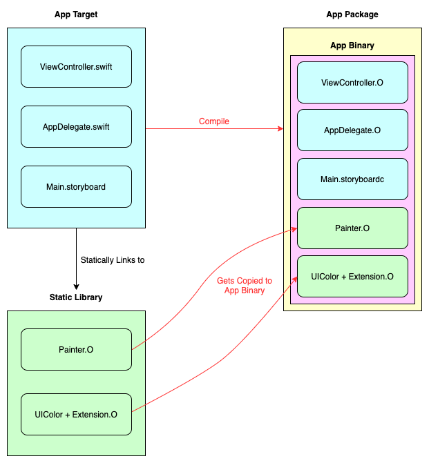

[Original Link](https://medium.com/swift-india/static-library-in-ios-d133123678d1)

# Static Library in iOS
## Introduction
Bài viết giới thiệu về Static Library, các ưu nhược điểm và cách sử dụng chúng trong iOS project

## Static Library
Là 1 file .a (Archive) chứa source code đã được compile

## Lợi ích
Có 2 lợi ích nổi bật:
1. __Reduce app compile time:__ Bằng cách distributing pre-compiled static library binary, chúng ta có thể giảm thời gian compile nếu so với việc compile tất cả các source file
2. __Reduce app launch time:__ Cách mà Static Library work so sánh với Dynamic Frameworks, chúng ta có thể tối ưu hoá dylib loading time của Pre-main time, giúp cho app launch nhanh hơn

## Content của Static Library
Bao gồm các Object files. Chúng ta có thể sử dụng tool ar để xem các file .o hoặc tool nm để xem các symbols

## How it work
Link file .a với App Target, nó sẽ được copy vào app binary nhờ vào Static Linking

## Khi nào không nên dùng static library
* __App size:__ Sẽ tăng
* __Resources:__ Library chỉ chứa source code, nó không thể chứa các resources như Assets, Xibs, Storyboard hoặc JSON
