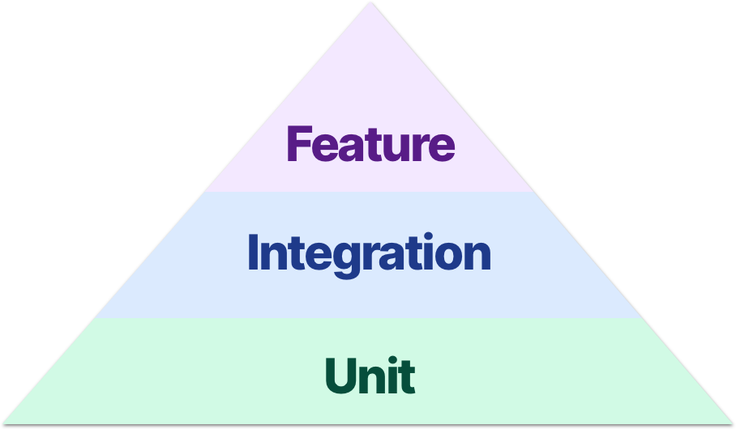

[Original Link](https://masilotti.com/testing-ui-without-ui-testing/)

# Testing the UI without UI Testing in Swift
## Introduction
Bài viết giới thiệu 1 vài trường hợp về việc testing UI mà không cần dùng XCUITest, chỉ dùng XCTest



## Unit test
Là lowest level of testing,  __“unit”__  thường là 1 __struct__ hoặc __class__.

## Integration test
1 level cao hơn là integration test, có thể dễ hình dung là gom các unit khác nhau lại và để chúng phối hợp.
Integration test sẽ bắt dầu ở nơi nào đó nằm giữa stack và stub out càng ít càng tốt.
Ví dụ, test khi 1 hàm cụ thể sẽ được call trên 1 controller khi table view add thêm 1 row. Chúng ta có thể stub out network connection nhưng việc tương tác với model thì nên để nguyên.

## Feature test
Thường dành cho UI testing, sẽ test toàn bộ stack của application.
Ví dụ, __tap vào 1 button__ hoặc __pull to refresh__. Test bắt đầu với 1 __human interaction__ và kết thúc với việc verify 1 cái gì đó mà user có thể  thấy trên màn hình.
Ngoại trừ network connection, third-party code hoặc seed data, đối với feature test thường chúng ta hiếm khi phải stub thứ gì.

## Feature test without UI testing
Thường dành cho UI testing, sẽ test toàn bộ stack của application.

#### Test tapping 1 button
```swift
func testTappingAButton() throws {
    let storyboard = UIStoryboard(name: "Main", bundle: nil)
    let controller = storyboard.instantiateViewController(identifier: "Home")
        as! HomeViewController
    controller.loadViewIfNeeded()

    controller.toggleTextButton.sendActions(for: .touchUpInside)

    XCTAssertFalse(controller.textLabel.isHidden)
}
```
Ta phải gọi loadViewIfNeeded để button được init, sau đó ta có thể trigger 1 tap action.

#### Test pushing view controller
```swift
func testPushingAViewController() throws {
    let storyboard = UIStoryboard(name: “Main”, bundle: nil)
    let navigationController = storyboard.instantiateInitialViewController()
        as? UINavigationController
    let homeViewController = navigationController?.topViewController
        as! HomeViewController
    homeViewController.loadViewIfNeeded()

    homeViewController.pushDetailButton.sendActions(for: .touchUpInside)
    RunLoop.current.run(until: Date())

    XCTAssertEqual(navigationController?.viewControllers.count, 2)
    XCTAssert(navigationController?.topViewController is DetailViewController)
}
```
Lưu ý, nếu ta muốn push với animated = true, ta phải call RunLoop vì việc animation xảy ra bên ngoài scope của test và nó là asynchronous.
Việc call RunLoop sẽ làm cho test được delay “1 ít” đủ để catch up với animation. Lúc ấy 2 câu lệnh Assert ở cuối hàm mới chạy đúng.

#### Test presenting modal view controller
```swift
func testPresentingAModalViewController() throws {
    // load the controllers
    let storyboard = UIStoryboard(name: "Main", bundle: nil)
    let navigationController = storyboard.instantiateInitialViewController()
        as? UINavigationController
    let homeViewController = navigationController? .topViewController
        as! HomeViewController

    // attach them to a real window
    let window = UIWindow()
    window.rootViewController = navigationController
    window.makeKeyAndVisible()
    homeViewController.loadViewIfNeeded()

    // tap the button and tick the run loop
    homeViewController.presentModalButton.sendActions(for: .touchUpInside)
    RunLoop.current.run(until: Date())

    // run the assertions
    let presentedViewController = navigationController?.presentedViewController
    XCTAssertNotNil(presentedViewController)
    XCTAssert(presentedViewController is ModalViewController)
}
```
Đối với test presenting, ngoài việc call RunLoop ta lưu ý phải __make 1 window__

## Ba hướng tiếp cận mới đối với XCTest
* Send action đến button để simulate 1 tap
* Tick run lopp để “đợi” pushing controller
* Sử dụng real UIWindow để simulate 1 real app