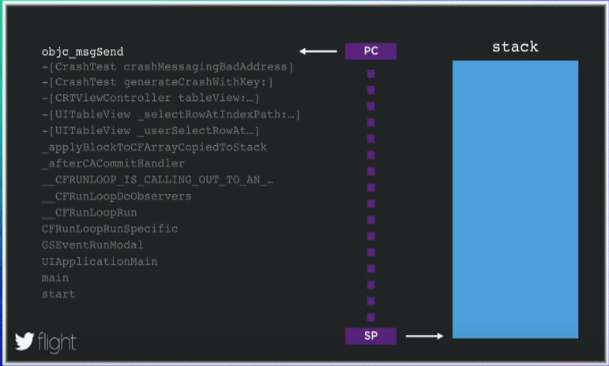

[Original Link](https://www.youtube.com/watch?v=6EsCWWXv7jg)

# Twitter Flight 2015 - iOS Crash Reporting by Matt Massicotte
## Introduction
Video này, 1 kỹ sư ở Crashlytics trình bày tổng quan về những challenge và solution mà họ đã dùng để implement crash report.

## Crash detect
#### NSSetUncaughtExceptionHandler
```objc
NSSetUncaughtExceptionHandler(myHandler)
```
But a lot of crashes not relate to exceptions

#### POSIX signals
```objc
sigaction(SIGSEGV, &newAction, &previousAction)
```
Rất ít API safe to call from signal handler

#### Mach exception
```objc
task_swap_exception_ports(mach_task_self(), …)
```

## Registers states



Khi crash xảy ra, ta cần phải get từ OS trạng thái hiện tại của các registers, chúng ta sẽ chú ý 2 cái là PC (Program Counter) và SP (Stack Pointer)
* __PC:__ Address của currently executing instruction và dĩ nhiên instruction này phải nằm trong message send function. Sử dụng 1 process được gọi là __symbolication__, ta có thể chuyển address đó thành __objc_msgSend__. Tuy nhiên, để có thể xây dựng stack trace chúng ta cần thêm __SP - Stack Pointer__
* __SP:__ Đó là 1 pointer trỏ tới bottom của stack. Mỗi lần 1 function được gọi, vài thông tin về nó sẽ được push vào stack, nhiều thứ cũng được push vào stack gồm __local variable, func parameters__.

## Stack Unwinding
Điều khó khăn là không thể phân biệt được với data đến từ những hàm khác. Nếu chúng ta có cách để lấy được address của next func (trong trace) trên Stack, ta có thể lại áp dụng symbolication để get được thông tin.
Và nếu chúng ta tiếp tục get được address tiếp theo, symbolication ta sẽ xây dựng được toàn bộ function stack trace. Quá trình này được gọi là __Stack Unwinding__. Nó đòi hỏi phải biết kiến thức về __ABI, application binary interface__.

Có 3 options để thực hiện stack unwinding
* __Frame Pointers:__ Khi compiler generate code cho 1 function, nó sẽ thêm vào 1 vài thông tin vào stack, về cơ bản stack có thể xem như là 1 linked list đơn giản. Tuy nhiên không phải tất cả các function đều lưu lại frame pointer.
* __DWARF CFI (Call Frame Information).__
* __Compact unwind__

(Reading)
