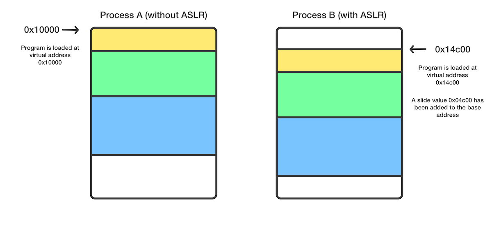

[Original Link](https://bellis1000.medium.com/aslr-the-ios-kernel-how-virtual-address-spaces-are-randomised-d76d14dc7ebb)

# ASLR & the iOS Kernel — How virtual address spaces are randomised
## Introduction
Bài viết mô tả về kỹ thuật ASLR (Address Space Layout Randomisation) và cách nó được áp dụng trong iOS Kernel.

## ASLR
Kỹ thuật này sẽ làm tăng thêm độ khó nếu 1 hacker muốn locate specific parts của 1 program trên memory bằng cách random memory address space của program mỗi lần nó được launch.
Cách mà ASLR thực hiện là sliding toàn bộ process address space theo 1 con số nào đó (tương tự như offset).

Như hình minh họa, process A được load vào memory tại static virtual address - 0x10000. Process A sẽ luôn luôn được load vào memory tại address đó vì nó không có ASLR.
Process B, mặt khác, được load vào memory tại vị trí 0x14c00. Base address này được dynamically calculated mỗi lần process B được launch. 

## iOS Kernel
Trên iOS, kỹ thuật này được áp dụng cho cả Kernel process và User-land process.
iOS Kernel dựa trên XNU và XNU là open source. Tuy nhiên, những đoạn code new, iOS-specific mà Apple thêm vào XNU thì lại là closed source. Mặc dù vậy, refer đến XNU source code cũng giúp ta phần nào hiểu được high-level của vài phần trong iOS Kernel code base.
Hàm load_machfile() trong bsd/kern/mach_loader.c trong XNU sẽ chịu trách nhiệm parsing Mach-O file (là file executable dùng trên iOS) và setup new task, loading vào memory, v.v.. Mỗi lần bạn mở 1 app hoặc run 1 binary trên iPhone, hàm này sẽ được gọi trong kernel.
ASLR slide cho new process sẽ được generate ra trong hàm này.

Như đoạn code ta có thể thấy, thực tế có 2 giá trị ASLR slide được gen ra, 1 cái cho process và 1 cái cho dlyd.
Trong bài blog này, tác giả có minh họa 1 kỹ thuật dựa trên reverse engineering để disable ASLR. Dĩ nhiên là việc thử nghiệm phải được tiến hành trên iPhone đã jailbreak.
Tác giả đã thay đổi Assembly Code chịu trách nhiệm cho việc generate ASLR slide.
