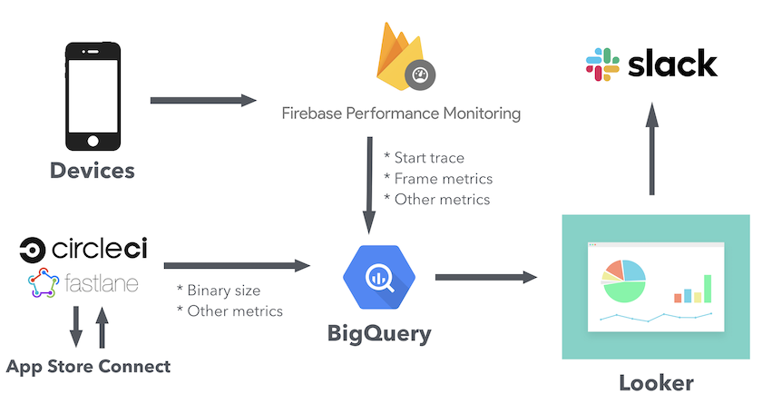
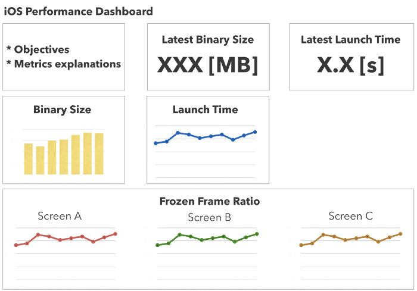

[Original Link](https://medium.com/mercari-engineering/one-approach-to-monitoring-ios-application-performance-dca73d02b2e8)

# One approach to monitoring iOS application performance
## Introduction
Bài viết giới thiệu về 1 solution cho __monitoring performance__ của iOS app.

## Các options
#### Build 1 in-house foundation
Ta có thể dùng ___measure(_:)__ trong XCTest.framework để track performance, run trên CI để phân tích kết quả, và liên tục execute để bảo đảm target operations performing như expected.
Cách tiếp cận này có ưu điểm là ta có thể nhanh chóng phát hiện ra performance issue trước khi app được release. Tuy nhiên, cách này đòi hỏi ta phải có resource để có thể build và maintain testing codebase và CI system.

#### Tích hợp third-party solutions
Sử dụng __Firebase Performance Monitoring (FPM)__. Ưu điểm là ta không cần phải tự build và maintain. 
Tuy nhiên, nhược điểm là
* Chỉ thấy data sau khi release changes đến users
* Không thể control codebase hoặc metrics để track

Ngoài ra, FPM còn có nhược điểm:
* Web Dashboard không thể customize
* Không thể alert khi performance suy giảm.

#### Solution
Tác giả sử dụng solution là dùng FPM như datasource của việc tracking nhưng sẽ customize lại Dash Board.

#### Export FPM data đến BigQuery
FPM cho phép export performance data vào __Google BigQuery__.

## Architecture Overview
FPM send data đến BigQuery. Bên cạnh FPM, 1 vài data ví dụ như binary size cũng đc send từ CI (CircleCI) đến BigQuery. Data thu thập được sẽ được visualized bằng DashBoard (sử dụng Looker). 
Khi detect được performance issue, alert sẽ được gửi đến Slack.

## Các metrics cần monitor
#### App Start Trace (từ FPM)
Một trong những metric quan trọng nhất:
* Start khi application load first object vào memory
* Stop khi first run loop successful sau khi application nhận __UIApplicationDidBecomeActiveNotification__

#### Frozen Frame Ratio (từ FPM)
Tỷ lệ frozen frame của 1 màn hình, dao động từ 0 đến 1. Ví dụ 0.05 nghĩa là có 5% frame của màn hình này mất hơn 700ms để load.

#### Binary Size (từ AppStore Connect)
Binary size không thể get từ FPM nên chúng ta get giá trị này trực tiếp từ AppStore connect. Chúng ta có thể dùng hàm __tunes_build_details__ từ Fastlane’s spaceship

## DashBoard và Alerting
__Looker__ là 1 Visualization Tool có thể tích hợp với Slack và send alert.

