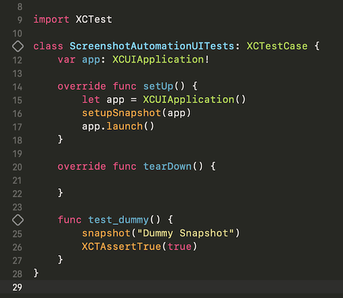
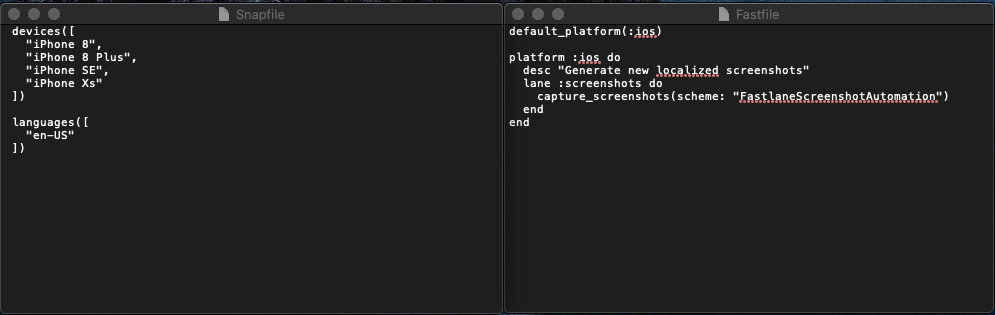

[Original Link](https://medium.com/codablestudio/screenshots-automation-for-ios-with-bitrise-fastlane-5899eeb3d6b)

# Screenshot automation on iOS with Bitrise & Fastlane
## Introduction
Bài viết giới thiệu về auto gen screenshots bằng Fastlane và dùng CI/CD là Bitrise

## Fastlane
Để có thể sử dụng Fastlane để gen ra screenshots ta phải: 

#### Project:
* Tạo ra 1 scheme mới và mark nó là Shared
* Setup 1 XCUITests mà sẽ show ra screen mà ta muốn screenshot. 
* Trong hàm setup() của TestCase, ta phải gọi setupSnapshot(). 
* Trong các hàm tests, nếu ta muốn snapshot screen vào lúc nào thì chỉ cần gọi hàm snapshot() 

#### Fastlane:
__Snapfile:__ configuration cho các screenshot (loại devices, languages, v.v…)
__Fastfile:__ những lane mà Fastlane có thể dùng.

