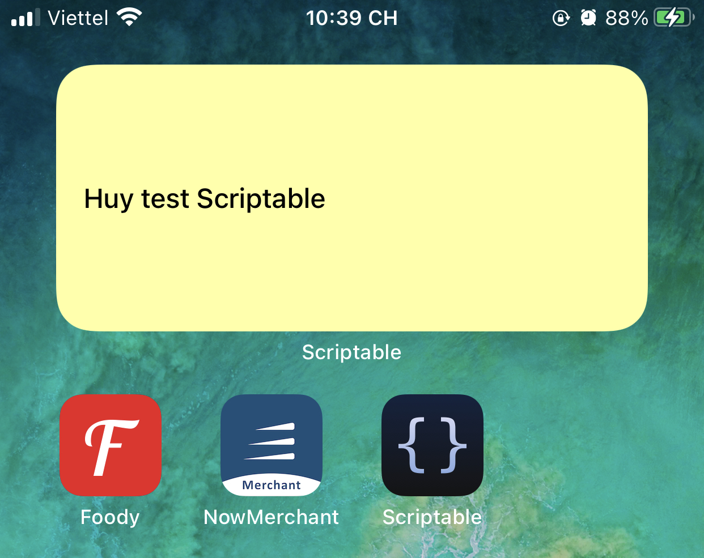

[Original Link](https://dev.to/matthri/unofficial-dev-to-ios-widget-4cpo)

# Unofficial dev.to iOS widget
## Introduction
Bài viết giới thiệu về Scriptable, là 1 iOS app giúp ta có thể tạo ra các custom widget bằng Javascript

## Scriptable
Dĩ nhiên là custom widget thì cũng chỉ là 1 loại widget, và như mọi widget, nó không thể được cài riêng lẻ lên phone mà phải có 1 iOS app. Do đó, đầu tiên ta cần phải cài app Scriptable từ AppStore.

## Javascript
Sau đó, ta có thể viết các đoạn javascript dựa vào APIs từ https://docs.scriptable.app/ để tạo ra custom widget

