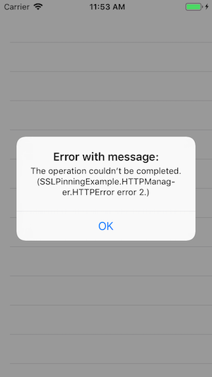

[Original Link](https://betterprogramming.pub/secure-ios-apps-through-app-pinning-4106d31c5d7d)

# Secure iOS Apps Through App Pinning
## Introduction
Bài viết giới thiệu về cách sử dụng __SSL Pinning__ để làm cho iOS app secure hơn.

## Man-in-middle attack
Trên iOS, các certificates trong iOS Trust Store được dùng để thiết lập connection. Nếu hacker có thể inject self-signed certificate vào trong Trust Store, man-in-attack có thể xảy ra khi app tưởng rằng nó đang communicate với 1 server đã trusted.
Một cách khác là bằng cách hacking vào root CA certificate

## SSL Pinning
SSL certificate của target server được lưu trực tiếp vào trong app bundle và được dùng khi định nghĩa pinned certificate. Tính năng này dựa trên Apple’s App Transport Security (ATS) đã có từ iOS 9.

## Chain of trust
Validate từng certificate up to root certificate. Do đó, root CA phải được tin tưởng.

## Implementation
Accessing the certificate
```sh
$ openssl s_client -connect haveibeenpwned.com:443 </dev/null
```
Sau đó, ta copy certificate này thành 1 file
```sh
openssl s_client -connect haveibeenpwned.com:443 </dev/null | openssl x509 -outform DER -out haveibeenpwned.com.der
```
Sau đó ta drag and drop nó vào trong project

## Charles
Ta có thể dùng Charles để test thử thì sẽ nhận thấy request không thể thực hiện được nữa cho dù ta có enable SSL proxying trong Charles
