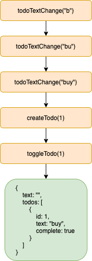

[Original Link](https://fmo91.medium.com/unidirectional-architectures-and-time-traveling-in-swift-i-55085d31eff2)

# Unidirectional Architectures and time traveling in Swift: I
## Introduction
Bài viết giới thiệu về __Unidirectional Architectures__. Ý tưởng chủ yếu của architecture này đến từ Javascript. Ở frontend application, chúng ta có thể lưu lại user session và sau đó reproduce các __action, go back, go forwad, v.v…__ và “travel” in time.

## Action
Là 1 object, mô tả 1 điều gì đó vừa xảy ra trong hệ thống.
Ví dụ:
* User change text trong 1 textfield
* User tap vào button để tạo new TODO
* User hoàn thành 1 TODO

## State
Để get được 1 State nào đó của system, ta cần phải apply 1 cách tuần tự các __Action__ object. Ngoài cách này ra, không gì khác có thể affect hoặc modify State.

## Reducer
Là 1 pure function. Nó là hàm duy nhất được phép mutate State. Thật ra, nó sẽ không hẳn là mutate State mà sẽ tạo ra State mới dựa trên previous State và Action.

## f(State) = UI
View cũng nên là pure function của application state.

## Store
Là component sẽ giữ State và Reducer, expose ra 1 hàm được gọi là __dispatch(action:)__, hàm này sẽ nhận 1 Action và thay State hiện tại bằng kết quả nhận về từ hàm reduce

## Composable Architecture
1 ví dụ apply hoàn chỉnh cho kiến trúc này là từ [ Link](https://github.com/pointfreeco/swift-composable-architecture)
