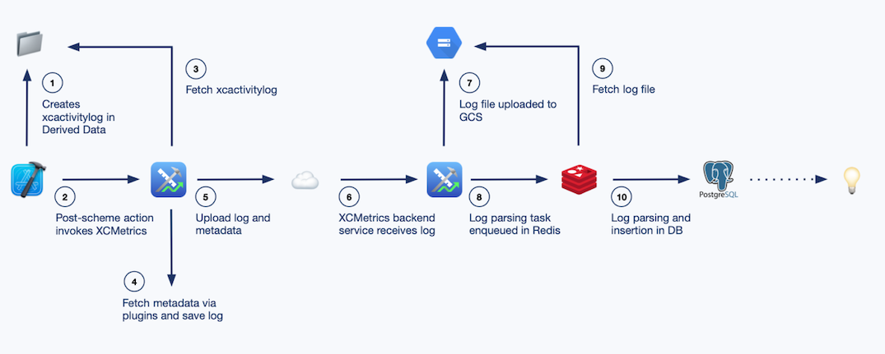

[Original Link](https://engineering.atspotify.com/2021/01/20/introducing-xcmetrics-our-all-in-one-tool-for-tracking-xcode-build-metrics/)

# Introducing XCMetrics: Our All-in-One Tool for Tracking Xcode Build Metrics
## Introduction
Bài viết giới thiệu về __XCMetrics__, 1 giải pháp toàn diện được phát triển bởi Spotify giúp cho việc collect, display và track các metrics của XCode build logs. Từ đó ta có thể biết được build performance đang tốt hay xấu hơn và có thể improve.

## XCLogParser
Trước khi có XCMetrics, team Spotify đã phát triển và sử dụng XCLogParser, 1 công cụ giúp parse file __xcactivitylog__ của XCode thành dạng dễ đọc hơn. Tuy nhiên, đây chỉ là giải pháp simple và thuần tuý chỉ Parse data.

## XCMetrics
Sau đó, team Spotify đã quyết định phát triển 1 giải pháp toàn diện hơn bao gồm collect build data ở máy local, parse, upload và lưu trữ trên server. Sau đó ta có thể tracking data và get insights build performance trong suốt quá trình development của team. 

## Architecture Overview
* _Swift CLI tool:_ invoke post-scheme action sau mỗi lần build để cache và upload build metrics
* _Backend service:_ nhận log và metadata thông qua multipart request.
* _PostgreSQL database:_ khi log được parse xong, data sẽ được insert vào database, được phân chia theo ngày để dễ rút trích và phân tích history

## Service Deployment
Spotify đã cung cấp sẵn 1 Docker image có sẵn mọi thứ cần thiết để deploy XCMetrics backend.