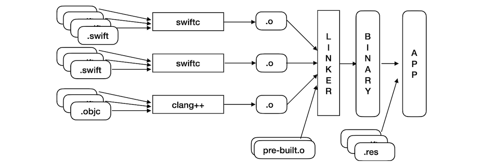
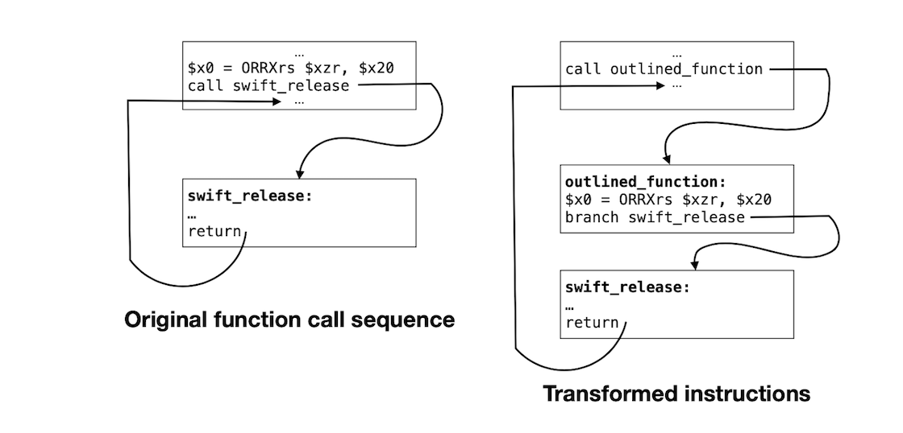
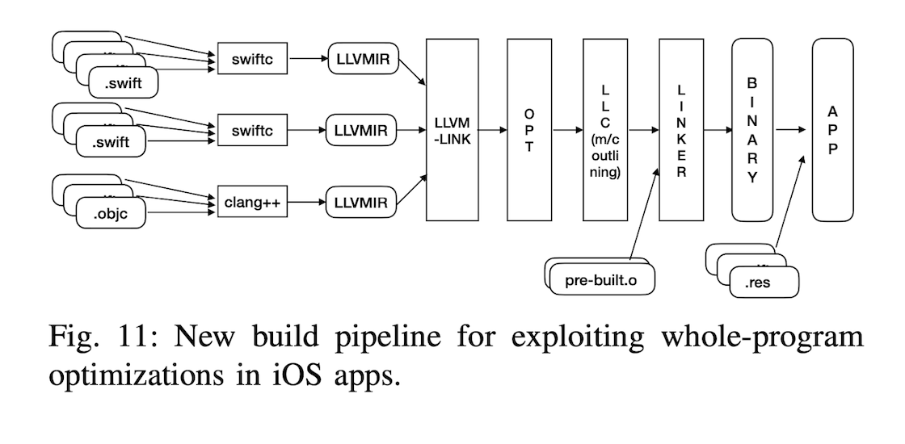
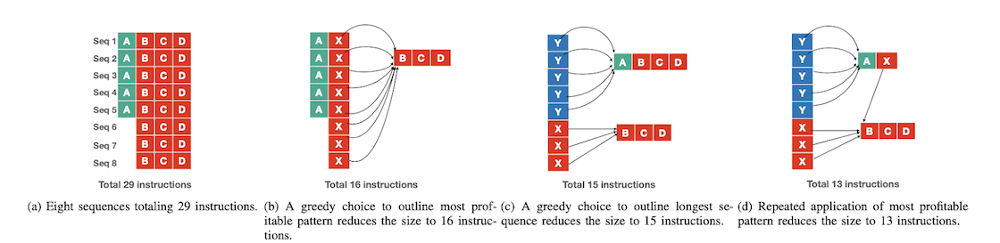

[Original Link](https://eng.uber.com/how-uber-deals-with-large-ios-app-size/)

# How Uber Deals with Large iOS App Size

## Introduction
In this blog, Uber iOS team introduce how to reduce app size by applying ___advanced compiler techniques.___

## Default build pipeline of Uber Rider app

At first, compiling all source files in a module to produce __object file (.o).__ It also compiles Objective-C files separately into object files. All object files, including pre-built binaries, are linked with system linker into final binary.
__Each module__ is compiled using whole-optimization in Swift compiler. __-Osize__ flag is used to produce a __size-optimized binary.__
A few more techniques and config can be used to reduce size app: avoiding large value types (e.g, struct or enum), restricting access control level to lowest, avoiding excessive use of generics, using final attributes, remove dead code and resources.
In this blog, Uber suggest opportunities for __cross-module optimization.__
## Optimize at binary level
Over 75% of app binary is machine instructions and a vast amount of __machine instruction sequences repeat frequently__.
So, we can subsitute a sequence with a __shorter sequence__, typically a single call or unconditional branch instruction to a single occurence of the pattern.

In above example two instructions call be replaced with a call instruction to newly created __outlined_function.__
_Machine-code sequences repeat frequently, and the frequency of repetition follows the power-law curve._ (Explanation of this is compliated, so we can skip).

## Causes of instruction-sequence repetition
1. High level language and runtime features related to __reference counting__ and __memory allocation__ are common causes of the most frequently repeated patterns.
2. The generous use of novel, __high-level language features__ and their corresponding code generation contribute to certain, very long and undesirable repeated patterns.

Example:
* _Generic functions_ and _Closure specialization_.
* O(n2) code blow-up from try expressions.

## Advanced compiler techniques
__machine-code outlining__ is a transformation available in _LLVM_, and most recent Swift compiler versions enable it if the code is compiled for size. 
However, in default pipeline, each module is converted into machine code. If we perform machine-code outlining __at each module level__, there will still be replicas present across modules and we’ll miss the opportunity to find replicas that __span across multi modules__.

## New iOS pipeline

New pipeline produce _LLVM-IR_ for _each module_, it then, combines all LLVM-IR files into one large IR file using _llvm-link._
Then, it perform all LLVM-IR level optimizations on this single IR file using opt. It then feed the optimized IR to _llc_, which lowers the IR to target machine code.

## Squeezing More Size with Repeated Machine Outlining
Machine outlining can be repeated multi rounds to reduce more size.

## Build time
Since build time significantly increases when compared to default pipeline, we do not perform these optimizations at _debug build_ but only on test and _release builds_. So, it doesn’t impact developer productivity.
