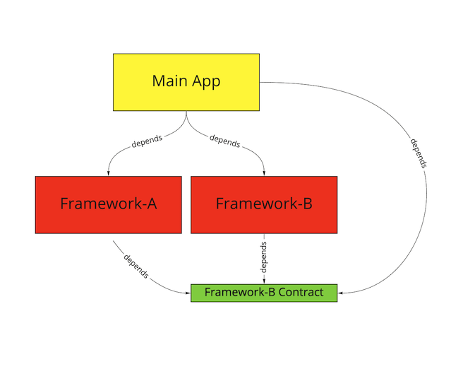
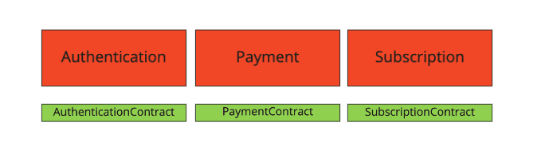

[Original Link](https://developers.soundcloud.com/blog/dependency-inversion-as-a-driver-to-scale-mobile-development)

# Dependency Inversion as a Driver to Scale Mobile Development

## Introduction
This post talks about Dependency Inversion applied for Framework Dependencies

## Example of Dependency Inversion

```swift
class ProfileViewController: UIViewController {
    func showFullName(_ fullName: String) { }
}

class ProfilePresenter {
    private weak var profileView: ProfileViewController?

    init(profileView: ProfileViewController) {
        self.profileView = profileView
    }

    func presentProfile(_ profile: Profile) {
        let fullName = profile.name + " " + profile.surname
        profileView?.showFullName(fullName)
    }
}

struct Profile {
    let name: String
    let surname: String
    let artworkUrl: String
}
```

In this example, ProfilePresenter directly denpends on ProfileViewController. So ProfilePresenter cannot easily replace current view (ProfileViewController) with another view.
Example, a new view for premium users.

_So, we break the current dependency into two weaker dependencies and point them to the new abstraction._
```swift
protocol ProfileViewing: class {
    func showFullName(_ fullName: String)
}

class ProfileViewController: UIViewController, ProfileViewing {
    func showFullName(_ fullName: String) { }
}

class ProfilePresenter {
    private weak var profileView: ProfileViewing?

    init(profileView: ProfileViewing) {
        self.profileView = profileView
    }

    func presentProfile(_ profile: Profile) {
        let fullName = profile.name + " " + profile.surname
        profileView?.showFullName(fullName)
    }
}
```
## Dependency Inversion for Framework Dependencies
We can apply the same for Frameworks. We create a new framework contains contracts and other frameworks depend on it.

Example: a new framework will be created (AuthenticationContract). Other frameworks (Payment and Authentication) depend on it.

### _Payment_
```swift
import AuthenticationContract

public class PaymentManager {
    private let authenticator: Authenticating

    public init(authenticator: Authenticating) {
        self.authenticator = authenticator
    }

    func doFoo() {
        authenticator.authenticate()
    }
}
```

### _Authentication_
```swift
import AuthenticationContract

public class Authenticator: Authenticating {
    public init() { }
    public func authenticate() { }
}

AuthenticationContract framwork contains protocol
public protocol Authenticating {
    func authenticate()
}
```
Applied the same for other dependencies and we’ll have other contracts
