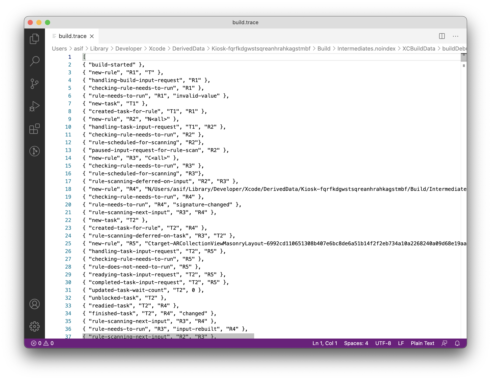

[Original Link](https://asifmohd.github.io/ios/2021/03/11/xcbuild-debug-info.html)

# Digging deeper into xcbuild: Rules and Tasks
## Introduction
This post talks about advanced knowledge about incremetal builds: Rules and Tasks. We will also learn how to improve quality of incremental builds (reducing build time).

## llbuid (low-level build system)
llbuild is a set of libraries for building build systems. In Xcode 10, Apple made this the default build system.
 We can enable the debug logs for xcbuild/llbuild and then investigate to figure out what could be causing rebuilds (obviously, too many rebuilds make build time high!).
 
## Enabling debug build flags
```sh
# Some minimal additional logging (this is safe to leave on).
defaults write com.apple.dt.XCBuild EnableDebugActivityLogs -bool YES

# Enable build debugging mode (safe to leave on, but slows down the build system & litters DerivedData/<project>/Build/Intermediates.noindex), generally should only be enabled when trying to capture a trace for incremental build debugging purposes.
defaults write com.apple.dt.XCBuild EnableBuildDebugging -bool YES
# You can also use:
env EnableBuildDebugging=YES xcodebuild -UseNewBuildSystem=1 ...
```
## Finding debug build logs
Debug build logs are generated in __DerivedData__
```
/~/Library/Developer/Xcode/DerivedData/YourProject-identifier/Build/Intermediates.noindex/XCBuildData/buildDebugging-timestamp/build.trace
```

## build.trace file
build.trace file lists a set of rules and tasks. 
___rule-needs-to-run___, gets a task scheduled for it by the build system. The reason can be listed as __signature-changed__ or __input-rebuilt__ and so on.



## Debugging
Look for ___rule-needs-to-run___ and ___CompileSwiftSources___ and find out a module which is triggering rebuilds

## Using XCLogParser
Besides build.trace, we can use [XCLogParser](https://github.com/spotify/XCLogParser) to investigate build logs.
Example, we can look for modules which are being rebuilt by searching for __fetchedFromCache: false__ in JSON exported from XCLogParser. 

## Run scripts and input/output file lists
Every run script added to a target, gets triggered on every build, even if there are no changes, unless we specify __input/output file lists__ for that run script.

## Case Study
Author used above technique and find out anomalies in a module had overridden __FRAMEWORK_SEARCH_PATHS__. After removing the  overrides to __FRAMEWORK_SEARCH_PATHS__, team was able to save 10 mins of incremental build time for every developer.
