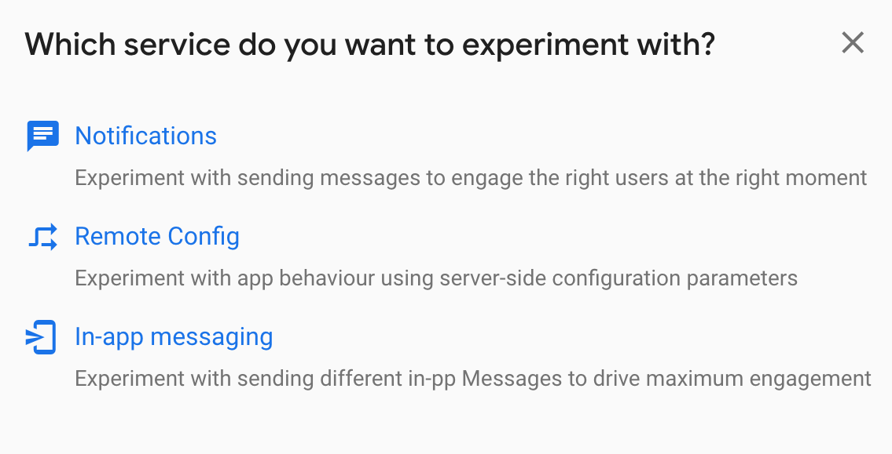

[Original Link](https://www.raywenderlich.com/20974552-firebase-tutorial-ios-a-b-testing)

# Firebase Tutorial: iOS A/B Testing
## Introduction
This post talks about applying iOS A/B Testing by Firebase

## Introduction to iOS A/B Testing
Ideally, you’d want to release two versions of your app simultaneously. One random group of users gets to see the new change, and the other group gets to see the current ones. As long as these two groups are unbiased, you can compare the results between them

## Adding Events
```swift
Analytics.logEvent("mainPageLoaded", parameters: nil)
```

## Creating First A/B Test
Head to the A/B Testing section of the Firebase console ->  click __Create experiment__


#### Defining Targeting
Decide what percentage of users to put into this experiment.


#### Defining Goals
This is the thing you’re looking to maximize in your app. For example, you’re looking to increase the occurrence of the __newsletterSubscribed__ event that you created earlier.


#### Defining Variants
 You’ll assign different Remote Config values to the different groups of people who are placed into your experiment.


