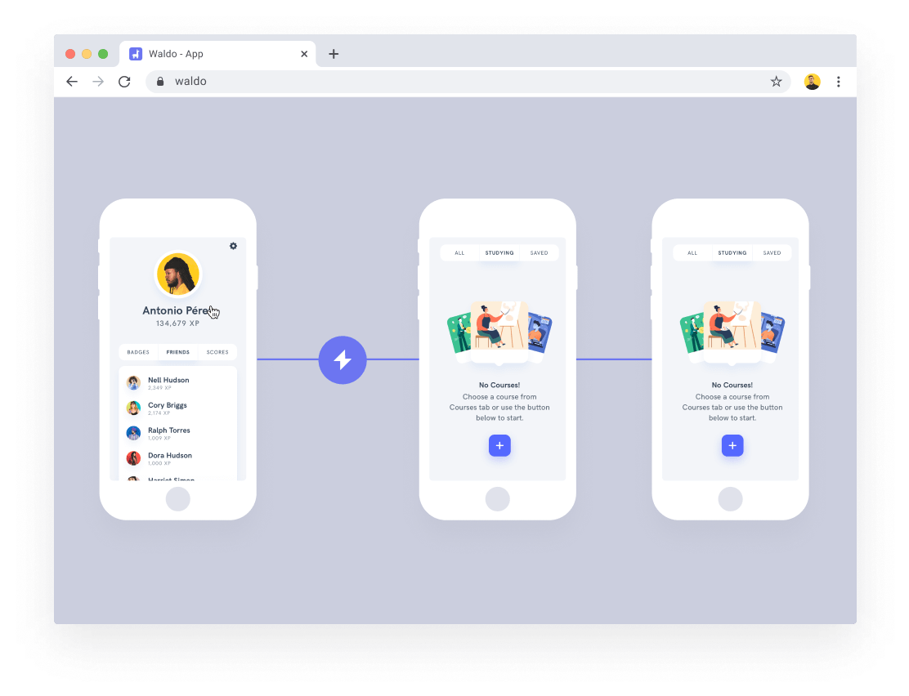

[Original Link](https://www.waldo.io/)

# Waldo
## Introduction
This post talks about __Waldo__, a no-code automated mobile testing service.

## Record tests in your browser
Upload your app to Waldo and walk through it as you would on your phone. Waldo records every screen and the logic that connects them to learn how your app is structured.

## Run your tests
Waldo reliably replays your tests against every new version of your app. It's automatic.

## Fix issues
If a test fails, Waldo lets you know precisely where things went wrong so you can update the failed test or alert your team to fix the issue.