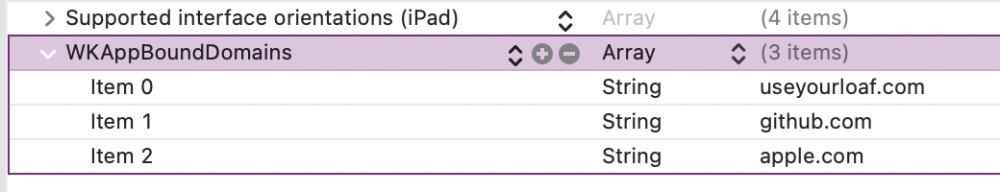

[Original Link](https://useyourloaf.com/blog/app-bound-domains)

# App Bound Domains
## Introduction
This post talks about App Bound Domains, a new feature in iOS 14. Users only allowed to browse a limited number of domains in our app using a WKWebView.

## Opt-In To App Bound Domains
Add an Array with the key WKAppBoundDomains in Info.plist and then list the domains (up to 10 domains):



```swift
func webView(_ webView: WKWebView,
  decidePolicyFor navigationAction: WKNavigationAction,
  decisionHandler: @escaping (WKNavigationActionPolicy) -> Void) {
  if let url = navigationAction.request.url,
    isDomainAllowed(url) {
    decisionHandler(.allow)
  } else {
    decisionHandler(.cancel)
  }
}
```

## Disable All Javascript

```swift
// This method requires iOS 13
func webView(_ webView: WKWebView,
  decidePolicyFor navigationAction: WKNavigationAction,
  preferences: WKWebpagePreferences,
  decisionHandler: @escaping
  (WKNavigationActionPolicy, WKWebpagePreferences) -> Void) {
  if #available(iOS 14.0, *) {
    preferences.allowsContentJavaScript = false
  }
  decisionHandler(.allow, preferences)
}
```


