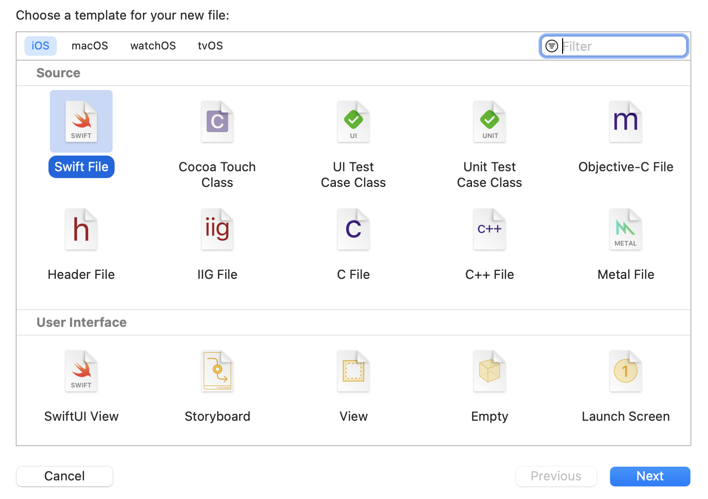

[Original Link](https://www.andyibanez.com/posts/xcode-new-file-templates/)

# Xcode New File Templates
## Introduction
This post talks about Xcode New File Templates 

## Template Format
Template are simple directory structures stored in the
```sh
~/Library/Developer/Xcode/Templates/File Templates/Custom Templates
```
Within this directory, you need more directories whose names will vary depending on the context of your template.

Example, if you make a template for __source__ file of __iOS__. You have to make a new directory with __.xctemplate__ extension:
```sh
~/Library/Developer/Xcode/Templates/File Templates/Custom Templates/iOS/Source/mytemplate.xctemplate
```
This new folder contains:
1. __TemplateIcon.png/TemplateIcon@2x.png:__ Optional thumbnails that will be visible in the New File Xcode window.
2. __TemplateInfo.plist:__ Use this file to provide basic template information, such as a summary and a description. 
3. __Base template file:__ This is the base template file. If you name it ___ FILEBASENAME___.swift, the new file will have the same name the user entered in the New File window. We can force a suffix like ___FILEBASENAME___Product.swift. 

## TemplateInfo.plist
Contains an __options__ array. When the user creates the file, we can prompt a vast array of different options of different types.

The options consist of:
* __Identifier:__ A unique identifier for our option. We can later refer to the value of the option by referencing the identifier as a variable, like this: ___VARIABLE_productType ___
* __Required:__ This item should be mandatory or not.
* __Description:__ A Description of the option
* __Type:__ The type of option this is (checkbox, text, combo, static, or popup).

## Building the Template
```swift
// ___FILEHEADER___

import Foundation

class ___FILEBASENAME___Product: Product {
  let brand: String
  
  let productType = "___VARIABLE_productType___"
  
  init(name: String, cost: Double, brand: String) {
    self.brand = brand
    super.init(name: name, cost: cost)
  }
  
  override func itemsInStock() -> Int {
    <#Return the amount #>
  }
}
```