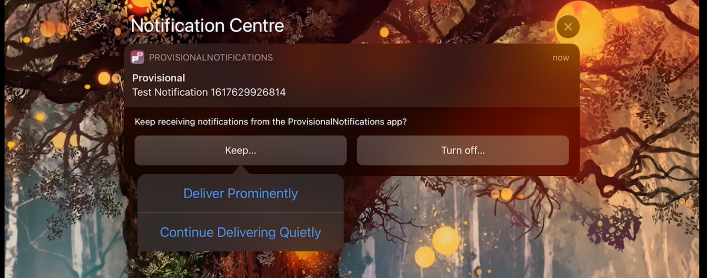

[Original Link](https://medium.com/@samermurad555/ios-provisional-notifications-eeb3832836fc)

# iOS Provisional Notifications
## Introduction
This post talks about ___Provisional Notifications___, what it is and the differences with old approach (normal Push Notifications).

## What are Provisional Notifications
Provisional Notifications are just normal Local and/or Remote Notifications. The small change is the new UNAuthorizationOption, ___UNAuthorizationOption.provisional___

```swift
 // base method for getting access
 func requestAccess(options: UNAuthorizationOptions, cb: GrantCb?) {
   // get center
   let center = UNUserNotificationCenter.current()
   // make sure to run on main thread
    DispatchQueue.main.async {
     center.requestAuthorization(options: options) { 
         (didGrant, error) in
           if error != nil {
              print("An error occurred", error ?? "no error")
              cb?(false)
           } else {
              cb?(true)
           }
       }
     }
 }
 // asking for provisional access by adding the .provisional option
 func provisionalAccess( _ cb: GrantCb?) {
    self.requestAccess(
       // + .provisional
       options: [.alert, .sound, .badge, .provisional],
        cb: cb
     )
  }
  
  // Explicit access (prompts user for permissions)
  func explicitAccess(_ cb: GrantCb?) {
     self.requestAccess(
         // without .provisional (explicit access)
         options: [.alert, .sound, .badge],
         cb: cb
      )
   }
```

If we use __provisionalAccess__, the Further Implementation of the AppDelegate and calling the ___UIApplication.shared.registerForRemoteNotifications()___ method allows us to obtain the ___deviceToken___ (without User Permission Prompt) and send it to the server for future push Notifications.
If we use ___explicitAccess___, a User Permission Prompt will be displayed as normally.

## How do Provisional Notifications differ from their older counterpart
Provisional Notifications, do not show banners, nor do they make any sounds when they arrive. It appears in Notification Center but otherwise do not signal for the user’s attention in any way.


The Notification has two call-to-actions (CTAs). 
* The right handed CTA (“Turn off..”), allows the user to turn the Provisional access off, essentially declining our permission to use notifications.
* The Left handed however, gives two possible options:
    1. Deliver Prominently
    2. Continue Delivering Quietly