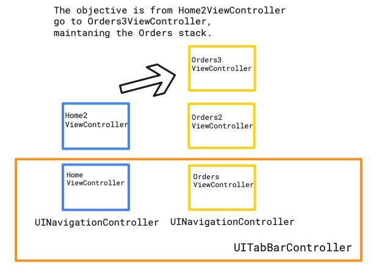
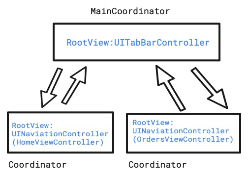

[Original Link](https://holyswift.app/coordinators-and-tab-bars-a-love-story)

# Coordinators and Tab Bars: A Love Story
## Introduction
This post talks about applying Coordinators Pattern to Tab Bars. Each of tab is a NavigationController.

## Problem

To solve this problem we will use coordinators with child coordinators.

## The Architecture


```swift
protocol MainBaseCoordinator: Coordinator {
    var homeCoordinator: HomeBaseCoordinator { get }
    var ordersCoordinator: OrdersBaseCoordinator { get }
    var deepLinkCoordinator: DeepLinkBaseCoordinator { get }
    func moveTo(flow: AppFlow)
    func handleDeepLink(text: String)
}

protocol HomeBaseCoordinator: Coordinator {
    func goToHome2ScreenWith(title: String)
    func goToFavoritesFlow()
    func goToDeepViewInFavoriteTab()
}

protocol OrdersBaseCoordinator: Coordinator {
    @discardableResult func goToOrder2Screen(animated: Bool ) -> Self
    @discardableResult func goToOrder3Screen(animated: Bool) -> Self
}
```

The last piece of the architecture are the HomeBaseCoordinated and OrdersBaseCoordinated protocols. TThey tell to the ViewController implementing them what flow they belong.

```swift
protocol HomeBaseCoordinated {
    var coordinator: HomeBaseCoordinator? { get }
}

protocol OrdersBaseCoordinated {
    var coordinator: OrdersBaseCoordinator? { get }

}
```

## Coordinators
#### Start our application flow:
```swift
func scene(
    _ scene: UIScene, 
    willConnectTo session: UISceneSession, 
    options connectionOptions: UIScene.ConnectionOptions
) {
    guard let windowScene = (scene as? UIWindowScene) else { return }

    window = UIWindow(windowScene: windowScene)
    window?.rootViewController = MainCoordinator().start()
    window?.makeKeyAndVisible()
}
```

#### MainCoordinator
```swift
enum AppFlow { // Mark 1
    case MostViewed
    case Favorites
}

class MainCoordinator: MainBaseCoordinator { // Mark 2

    var parentCoordinator: MainBaseCoordinator? // Mark 3

    // Mark 4
    lazy var homeCoordinator: HomeBaseCoordinator = HomeCoordinator()
    lazy var ordersCoordinator: OrdersBaseCoordinator = OrdersCoordinator()
    lazy var deepLinkCoordinator: DeepLinkBaseCoordinator = DeepLinkCoordinator(mainBaseCoordinator: self)

    // Mark 5
    lazy var rootViewController: UIViewController  = UITabBarController()

    // Mark 6
    func start() -> UIViewController { 

        let homeViewController = homeCoordinator.start()
        homeCoordinator.parentCoordinator = self
        homeViewController.tabBarItem = UITabBarItem(title: "Home", image: UIImage(systemName: "homekit"), tag: 0)

        let ordersViewController = ordersCoordinator.start()
        ordersCoordinator.parentCoordinator = self
        ordersViewController.tabBarItem = UITabBarItem(title: "Orders", image: UIImage(systemName: "doc.plaintext"), tag: 1)

        (rootViewController as? UITabBarController)?.viewControllers = [homeViewController,ordersViewController]

        return rootViewController
    }

    // Mark 7    
    func moveTo(flow: AppFlow) {
        switch flow {
        case .MostViewed:
            (rootViewController as? UITabBarController)?.selectedIndex = 0
        case .Favorites:
            (rootViewController as? UITabBarController)?.selectedIndex = 1 
        }
    }

    // Mark 8
    func handleDeepLink(text: String) {
        deepLinkCoordinator.handleDeeplink(deepLink: text)
    }

    // Mark 9
    func resetToRoot() -> Self {
        homeCoordinator.resetToRoot()
        moveTo(flow: .MostViewed)
        return self
    }
}
```

__Mark 1__ it's the enum that is used to change to other __app flow__. This is important because when a child need to change to another app flow ( in our case to another tab) the child coordinator doesn't need to know what exactly the other flow is, it just calls ___func moveTo(flow: AppFlow)___. And the parent coordinator takes the responsibility of it.

#### DeepLinkCoordinator
```swift
class DeepLinkCoordinator: DeepLinkBaseCoordinator {

    func handleDeeplink(deepLink: String) {
        print(" handle deep link here \(deepLink)")
    }

    var parentCoordinator: MainBaseCoordinator?

    init(mainBaseCoordinator: MainBaseCoordinator) {
        self.parentCoordinator = mainBaseCoordinator
    }
}
```

## View Files
#### Home Coordinator
```swift
import UIKit

class HomeCoordinator: HomeBaseCoordinator {

    var parentCoordinator: MainBaseCoordinator?

    lazy var rootViewController: UIViewController = UIViewController()

    func start() -> UIViewController { // Mark 1 
        rootViewController = UINavigationController(rootViewController: HomeViewController(coordinator: self))
        return rootViewController
    }

    func goToHome2ScreenWith(title: String) { // Mark 2
        let home2ViewController = Home2ViewController(coordinator: self)
        home2ViewController.title = title
        navigationRootViewController?.pushViewController(home2ViewController, animated: true)
    }

    func goToFavoritesFlow() { // Mark 3
        parentCoordinator?.moveTo(flow: .Favorites)
    }

    func goToDeepViewInFavoriteTab() { Mark 4
        parentCoordinator?.moveTo(flow: .Favorites)
        DispatchQueue.main.asyncAfter(deadline: .now()+0.1) { [weak self] in
            self?.parentCoordinator?.ordersCoordinator
                .resetToRoot()
                .goToOrder2Screen(animated: false)
                .goToOrder3Screen(animated: false)
        }
    }
}
```

```swift
class HomeViewController: UIViewController, HomeBaseCoordinated {
    var coordinator: HomeBaseCoordinator?
    ....
    
    @objc private func goToHome2() { // Mark 1
        coordinator?.goToHome2ScreenWith(title: "Top Title") 
    }   
}    
```

```swift
class Home2ViewController: UIViewController, HomeBaseCoordinated {
    ...
    
    @objc private func goToFavoriteTab() { //Mark 1
        coordinator?.parentCoordinator?.moveTo(flow: .Favorites)
    }

    @objc private func goToDeepViewInFavoriteTab() { // Mark 2
        coordinator?.goToDeepViewInFavoriteTab()
    }
}
```

#### Order Coordinator
```swift
class OrdersCoordinator: OrdersBaseCoordinator {

    var parentCoordinator: MainBaseCoordinator?
    var rootViewController: UIViewController = UIViewController()

    func start() -> UIViewController {
        rootViewController = UINavigationController(rootViewController: OrdersViewController(coordinator: self))
        return rootViewController
    }

    func goToOrder2Screen(animated: Bool = false) -> Self  {
        navigationRootViewController?.pushViewController(Orders2ViewController(coordinator: self), animated: animated)
        return self
    }

    func goToOrder3Screen(animated: Bool = false) -> Self {
        navigationRootViewController?.pushViewController(Orders3ViewController(coordinator: self), animated: animated)
        return self
    }
}
```

```swift
class OrdersViewController: UIViewController, OrdersBaseCoordinated {
    ...
    @objc private func goToHome2() {
        coordinator?.goToOrder2Screen(animated: true)
    }
}
```

```swift
class Orders2ViewController: UIViewController, OrdersBaseCoordinated {
    ...
    
    @objc private func goToOrders3Screen() {
        coordinator?.goToOrder3Screen(animated: true)
    }
}
```

```swift
class Orders3ViewController: UIViewController, OrdersBaseCoordinated {
    ...
}
```


