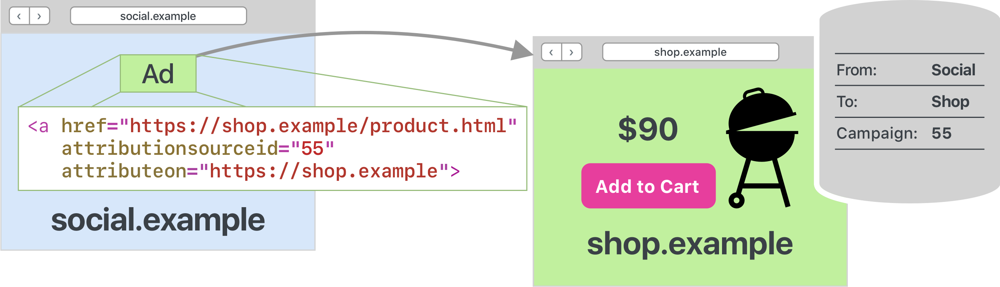
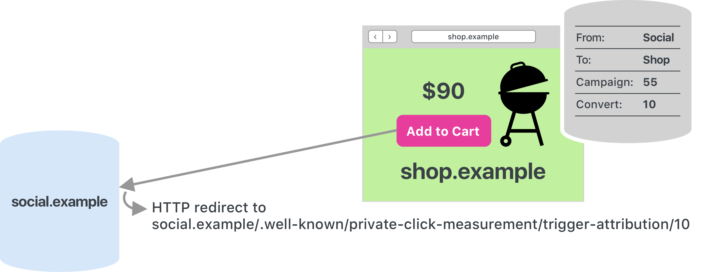
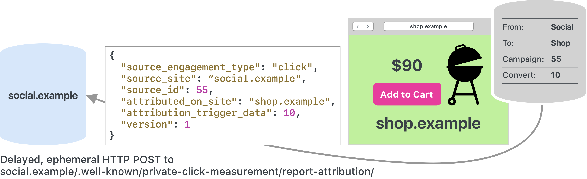
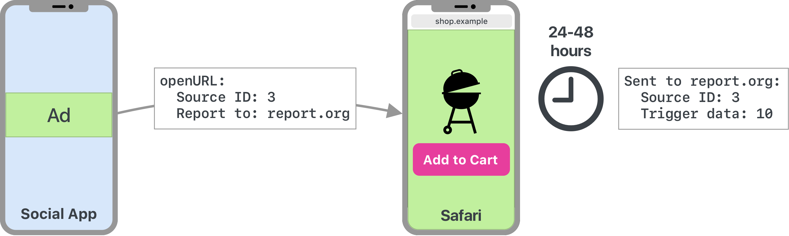

[Original Link](https://webkit.org/blog/11529/introducing-private-click-measurement-pcm/)

# Introducing Private Click Measurement, PCM
## Introduction
This post talks about Private Click Measurement (or PCM) for measuring ad clicks across websites and from iOS apps to websites. It is part of iOS and iPadOS 14.5 betas.

## Nutshell
* on-by-default feature called Private Click Measurement, or PCM, for privacy-preserving measurement of ad clicks across websites and from iOS apps to websites in iOS and iPadOS 14.5 betas.
* An 8-bit identifier on the click source side, which means 256 parallel ad campaigns can be measured per website or app.
* A 4-bit identifier on the conversion side, which means 16 different conversion events can be distinguished.

## Web-to-Web Click Measurement
#### The Click Side


```html
<!-- Link on social.example --> 
<a href="https://shop.example/product.html" 
   attributionsourceid="[8-bit source ID]"
   attributeon="https://shop.example">

  Markup

</a>
```

* attributionsourceid: The 8-bit attribution source ID. This was earlier referred to as the ad campaign ID.
* attributeon. The click destination website which wants to attribute incoming navigations to clicks. There is no separation based on subdomains.

#### The Triggering Event


The HTTP GET request to social.example triggers attribution if it is redirected to https://social.example/.well-known/private-click-measurement/trigger-attribution/[``4-bit`` trigger data]/[optional 6-bit priority].

* Trigger data. This is a 4-bit value between 00 and 15 that encodes the triggering event. This was earlier referred to as the conversion value.
* Optional priority. This is a 6-bit value between 00 and 63 which allows multiple triggering events to result in a single attribution report for the event with the highest priority. For instance, there might be multiple steps in a sales funnel where each step triggers attribution but steps further down the funnel have higher priority. 

Once a triggering event matches a stored click, a single attribution report is scheduled by the browser to be sent out randomly between 24 and 48 hours later, or the earliest time thereafter when the browser is running.

#### The Attribution Report

PCM attribution reports are sent as HTTP POST requests to /.well-known/private-click-measurement/report-attribution/ on the website where the click happened, in our example https://social.example/.well-known/private-click-measurement/report-attribution/. 

```json
{
  "source_engagement_type" : "click",
  "source_site" : "social.example",
  "source_id" : [8-bit source ID],
  "attributed_on_site" : "shop.example",
  "trigger_data" : [4-bit trigger data],
  "version": 1
}
```

## App-to-Web Click Measurement
#### The Click Side
The only thing that differs from PCM web-to-web is on the click side which is in an iOS app.



1. Add a URL to where you want PCM’s ad attribution reports to be sent when ads are clicked in your app. The key NSAdvertisingAttributionReportEndpoint in your Info.plist. 
2. Populate and add the new UIEventAttribution to the options of your call to openURL:.
3. Overlay the parts of the click-through ad that will trigger navigations to websites with the new UIEventAttributionView. The view does not consume the gesture. A user gesture is required for your UIEventAttribution object to be forwarded to the browser as part of the call to openURL:.


