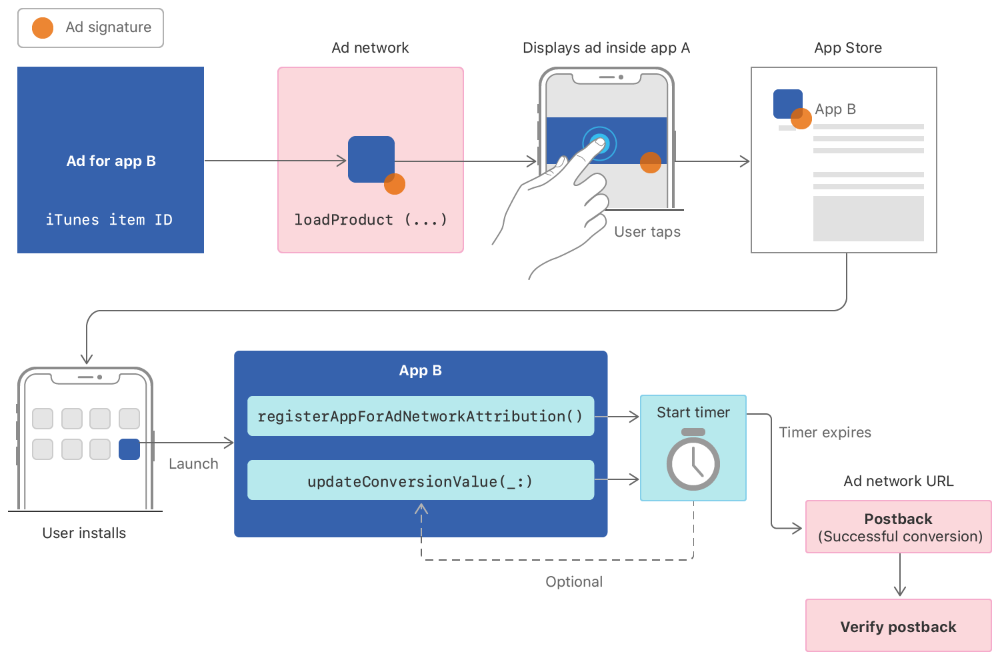

[Original Link](https://developer.apple.com/documentation/storekit/skadnetwork)

# SKAdNetwork
## Introduction
The ad network API helps advertisers measure the success of ad campaigns while maintaining user privacy. 
Ad networks must register with Apple, and developers must configure their apps to work with ad networks.

## Three participants
#### Ad networks
 Sign ads and receive install-validation postbacks after ads result in conversions.
 
#### Source apps
Display ads provided by the ad networks.

#### Advertised apps
Appear in the signed ads.

## Overview diagram

## Ad network’s responsibilities
* Register and provide its ad network ID to developers. 
* Provide signed ads to the source app.
* Receive install-validation postbacks at the URL it established during registration.
* Verify the postbacks. 

## Source app’s responsibilities 
* Add the ad network’s ID to its Info.plist.
* Display ads that the ad network signs.

## Advertised app’s responsibilities 
* Register an app installation by calling [registerAppForAdNetworkAttribution()](https://developer.apple.com/documentation/storekit/skadnetwork/2943654-registerappforadnetworkattributi) or [updateConversionValue(_:)](https://developer.apple.com/documentation/storekit/skadnetwork/3566697-updateconversionvalue).
* Optionally, update a conversion value by calling [updateConversionValue(_:)](https://developer.apple.com/documentation/storekit/skadnetwork/3566697-updateconversionvalue).