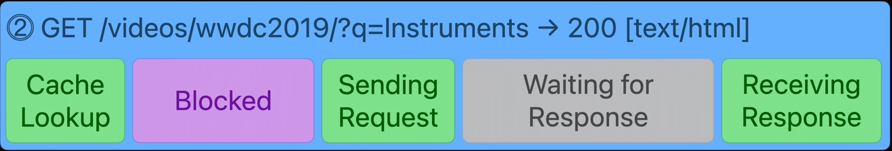

[Original Link](https://michaelabadi.com/articles/analyse-http-instruments/)
[WWDC](https://developer.apple.com/videos/play/wwdc2021/10212)

# Analyze HTTP Traffic with new HTTP Instrument
## Introduction
Using Instruments Network template to record and analyze app's HTTP traffic.

## Track hierachy
* `HTTP Traffic`: Number of active tasks
* `Process`: Debuggable processes and background tasks daemon 
* `Session`:
    - One track per URLSession object
    - Individual task intervals
    - Configurable session name
* `Domain`:
    - Only tasks that requested in domain
    - Giving more detail about tasks


## Task timing
```swift
let task = session.dataTask(with: url) {
    /* handle result */ // 👈🏻 Complete event triggers here
}

task.resume() // 👈🏻 Resume event triggers here
```

## Task identifier
```swift
let task = session.dataTask(with: url) {
    /* handle result */
}
task.taskDescription = "Load Thumbnail"
task.resume()
task.taskIdentifier // 👈🏻 this identifier will be shown in instruments
```

## Task Error


## Transactions
* A transaction is a pair of HTTP request and reponse. This pair is handled by URL Loading System by default.
* A task can be made of multiple transactions.


## Transaction states


## Instrument


#### Grouped by Connection


#### Backtrace


Where `resume` was called on the task


#### Unexpected transactions


Why does an `SignOn SDK` need user's location? It's really suspicious.
