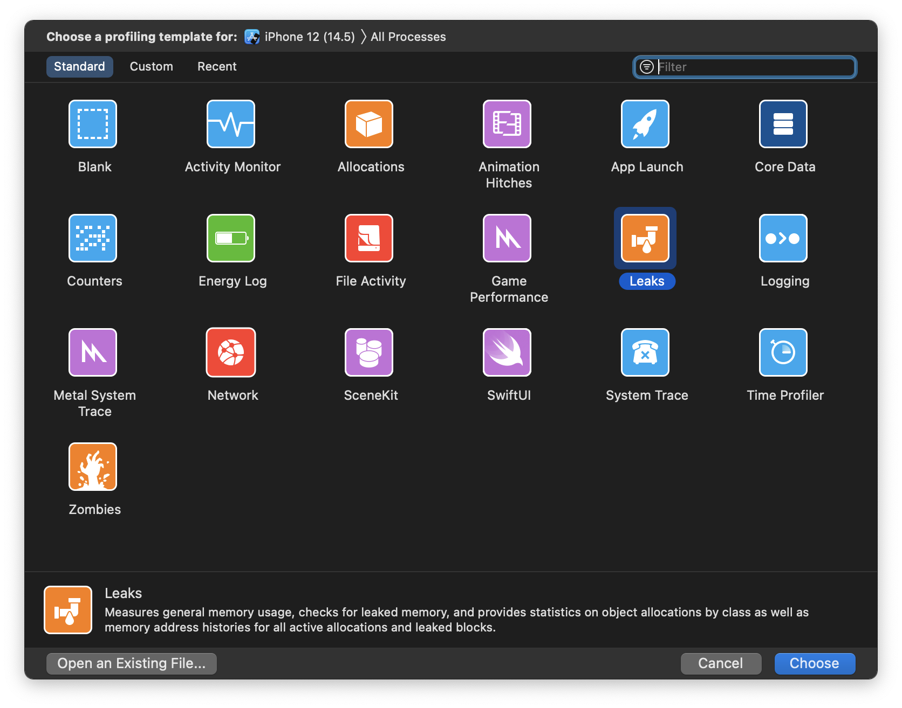
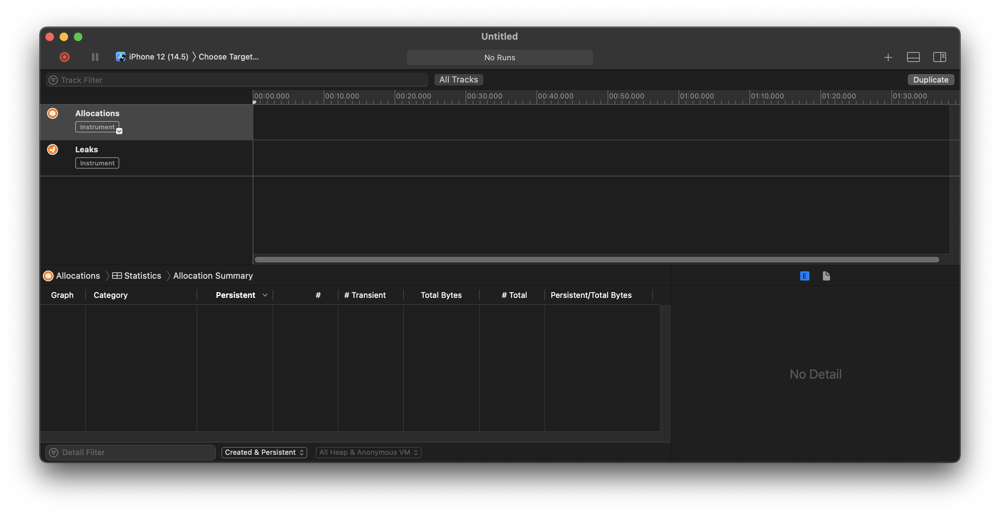

[Original Link](https://aclima93.com/swift/2021/06/24/01.html)

# Detecting memory leaks via tests
Part 1 - What, How, Why?

## Introduction
App keeps crashing for no apparent reason and we can't really reproduce it consistently, and it seems like it's affecting older devices more often. You probably witnessed first-hand the side-effects of memory leaks.

## How can I detect a memory leak before it crashes my app?



## How can it be automated?
#### Unit Test - Automated Leak Detection

```swift
class LeakCheckTestCase: XCTestCase {

    override func tearDown() {

        defer { super.tearDown() }

        let mirror = Mirror(reflecting: self)

        mirror.children.forEach { label, value in
            guard let propertyName = label else { return }

            // NOTE: If the value is something, e.g. not `nil` (a.k.a. not `Optional<Any>.none`),
            // then we have a potential leak.
            if case Optional<Any>.some(_) = value {
                XCTFail("\"\(propertyName)\" is a potential memory leak!")
            }
        }
    }
}

class SampleNonLeakingTestCase: LeakCheckTestCase {
    // ...

    override func tearDown() {

        // Make sure that our memory leak inspection is the last thing to happen
        defer { super.tearDown() }

        parentSUT = nil
        childSUT = nil
    }

    // ...
}
```

#### UI Test - Automated Leak Detection
* Can we do something with UI Tests? Sure, but instead of executing our leak detection at the end of each test, we're going to do it continously at the end of each step of our UI tests.
* Tool to help: [LifeTimeTracker](https://github.com/krzysztofzablocki/LifetimeTracker). 
    - It'll alert the user of detected memory leaks while using the app with an overlay.
* Finally, we can searc the UI for its leaks summary report.

```swift
class UITestCase: XCTestCase {

    typealias Step = () -> Void
    var steps = [String: Step]()

    let app = XCUIApplication()

    func createStep(withName name: String, _ step: @escaping Step) {
        steps[name] = step
    }

    func executeStep(withName name: String) {

        // Find block of code for step and execute it as a part of the test
        XCTContext.runActivity(named: name) {
            guard let step = steps[name] else {
                fatalError("No step named \'\(name)\'")
            }
            step()
        }

        // Check for memory leaks at the end of each step
        let leaksSummary = app.staticTexts["LifetimeTracker.summaryLabel"].firstMatch
        if leaksSummary.exists {
            XCTAssertEqual(leaksSummary.label, "No issues detected")
        }
    }
}

class LeakingUITest: UITestCase {

    override func setUp() {
        createStep(withName: "Check prompt exists") {
            XCTAssert(app.staticTexts["Some prompt"].exists)
        }

        // Assume that tapping the button has the unintended side-effect of creating a memory leak
        createStep(withName: "Tap button and expected outcome happens") {
            app.buttons["Some button"].tap()
            XCTAssert(app.staticTexts["Some expected outcome"].exists)
        }
    }

    func testExample() {
        executeStep(withName: "Check prompt exists")
        // In this scenario, this test would fail on the following line
        executeStep(withName: "Tap button and expected outcome happens")
    }
}
```
