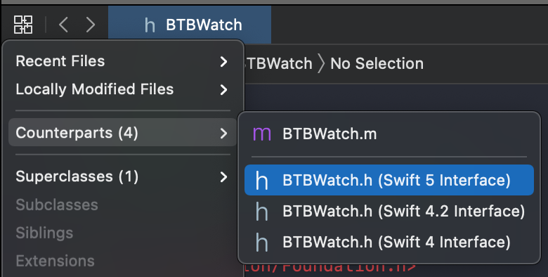

[Original Link](https://www.basbroek.nl/objc-swift-interop-auditing)

# Dancing with Dinosaurs I: Auditing Objective-C for Swift Interoperability
## Introduction
It's about Swift and Objective C interoperability

## Generated Interfaces
Xcode allow us to, for a given Objective-C header, generate its accompanying Swift interface
* Which at worst may be empty
* And at best (already) exposes your complete interface to Swift



If no interface is being generated at all, check if you're importing `Foundation` (`#import <Foundation/Foundation.h>`). This is often the culprit of
* No interface generated
* All types to be `Any` in Swift

## Intermission (Why Swift?)
* In Swift, the compiler can do so much more to help you write valid, safe code
* Auditing your code base to interface well with Swift has two clear benefits
    - It allows you to start writing Swift in non-production code, like tests which is a great way to start writing Swift code
    - The compiler can emit some warnings when you don't keep to the "contract". For example, you put an `NSString` in an array that you told the compiler will only contain `NSNumber` instances. There's also the concept of nullability. In Swift, the compiler will guarantee these things, and error if you don't comply to the rules.
    
## Nullability
* `nonnull`
* `nullable`
* `null_unspecified` - 
* `null_resettable`
* `NS_ASSUME_NONNULL_BEGIN`
* `NS_ASSUME_NONNULL_END`

Example:
```objc
#import <Foundation/Foundation.h>

NS_ASSUME_NONNULL_BEGIN

@interface BTBWatch : NSObject

- (NSInteger)currentHour;
- (NSInteger)currentMinute;
- (NSInteger)currentSecond;
- (NSDate *)currentDate;

- (BOOL)setTimeWithHours:(NSInteger)hours
                 minutes:(NSInteger)minutes
                 seconds:(NSInteger)seconds
                   error:(NSError **)error;
- (void)printCurrentTime;

@property (nonatomic) NSString *strapType;
@property (nonatomic, readonly) NSArray *functions;

@end

NS_ASSUME_NONNULL_END
```
Will be generated
```swift
open class BTBWatch : NSObject {
    open func currentHour() -> Int
    open func currentMinute() -> Int
    open func currentSecond() -> Int
    open func currentDate() -> Date

    open func setTimeWithHours(_ hours: Int, minutes: Int, seconds: Int) throws
    open func printCurrentTime()

    open var strapType: String
    open var functions: [Any] { get }
}
```

## Methods and Properties
Instead of
```objc
- (NSInteger)currentHour;
- (NSInteger)currentMinute;
- (NSInteger)currentSecond;
- (NSDate *)currentDate;
```
Which would generate
```swift
open func currentHour() -> Int
open func currentMinute() -> Int
open func currentSecond() -> Int
open func currentDate() -> Date
```
We'd want
```objc
@property (nonatomic, readonly) NSInteger currentHour;
@property (nonatomic, readonly) NSInteger currentMinute;
@property (nonatomic, readonly) NSInteger currentSecond;
@property (nonatomic, readonly) NSDate *currentDate;
```
Which generates the following
```swift
open var currentHour: Int { get }
open var currentMinute: Int { get }
open var currentSecond: Int { get }
open var currentDate: Date { get }
```

## Swift Renaming
Use `NS_SWIFT_NAME`
```objc
- (void)setTimeWithHours:(NSInteger)hours
                 minutes:(NSInteger)minutes
                 seconds:(NSInteger)seconds
                   error:(NSError **)error NS_SWIFT_NAME(setTime(hours:minutes:seconds:));
```
Which now generates the following, renamed function:
```swift
open func setTime(hours: Int, minutes: Int, seconds: Int) throws
```

## Namespaces
```objc
NS_SWIFT_NAME(Watch)
@interface BTBWatch : NSObject
```
```swift
open class Watch : NSObject {
    // ...
}
```

## Nesting Types
```objc
typedef NS_ENUM(NSInteger, BTBMovementType) {
    BTBMovementTypeQuartz,
    BTBMovementTypeManual,
    BTBMovementTypeAutomatic
} NS_SWIFT_NAME(Watch.MovementType);
```
```swift
extension Watch {
    public enum MovementType : Int {
        case quartz = 0
        case manual = 1
        case automatic = 2
    }
}
```

## Enums and Option Sets
```objc
NS_ASSUME_NONNULL_BEGIN

NS_SWIFT_NAME(Watch.Brand) typedef NSString * WatchBrand NS_TYPED_EXTENSIBLE_ENUM;
const WatchBrand patekPhilippe;
const WatchBrand aLangeSoehne;
const WatchBrand omega;
const WatchBrand meisterSinger;

NS_SWIFT_NAME(Watch)
@interface BTBWatch : NSObject

// ...
```
```swift
extension Watch {
    public struct Brand : Hashable, Equatable, RawRepresentable {
        public init(_ rawValue: String)
        public init(rawValue: String)
    }
}

extension Watch.Brand {
    public static let patekPhilippe: Watch.Brand
    public static let aLangeSoehne: Watch.Brand
    public static let omega: Watch.Brand
    public static let meisterSinger: Watch.Brand
}
```

## Option Sets
```objc
typedef NS_OPTIONS(NSInteger, BTBComplication) {
    BTBComplicationDateWindow            = 1 << 0,
    BTBComplicationPowerReserveIndicator = 1 << 1,
    BTBComplicationChronograph           = 1 << 2
} NS_SWIFT_NAME(Watch.Complication);
```
```swift
extension Watch {
    public struct Complication : OptionSet {
        public init(rawValue: Int)

        public static var dateWindow: Watch.Complication { get }
        public static var powerReserveIndicator: Watch.Complication { get }
        public static var chronograph: Watch.Complication { get }
    }
}
```

## Generics
```objc
@property (nonatomic, readonly) NSArray *functions;
```
Which generates
```swift
open var functions: [Any] { get }
```
We change it to
```objc
@property (nonatomic, readonly) NSArray<NSString *> *functions;
```
```swift
open var functions: [String] { get }
```
