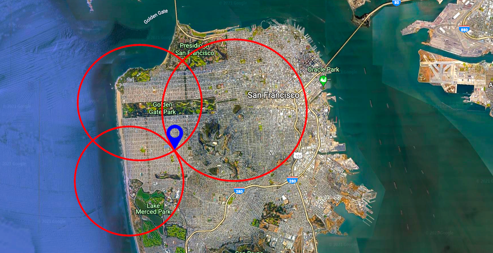
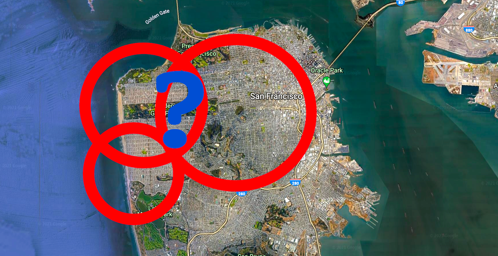
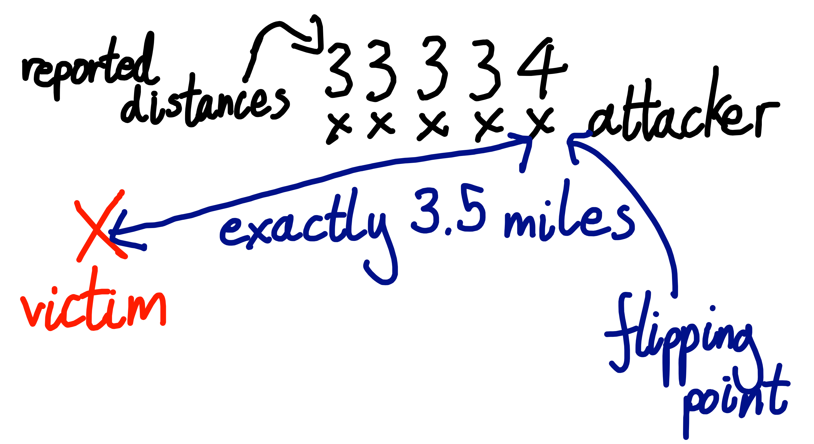
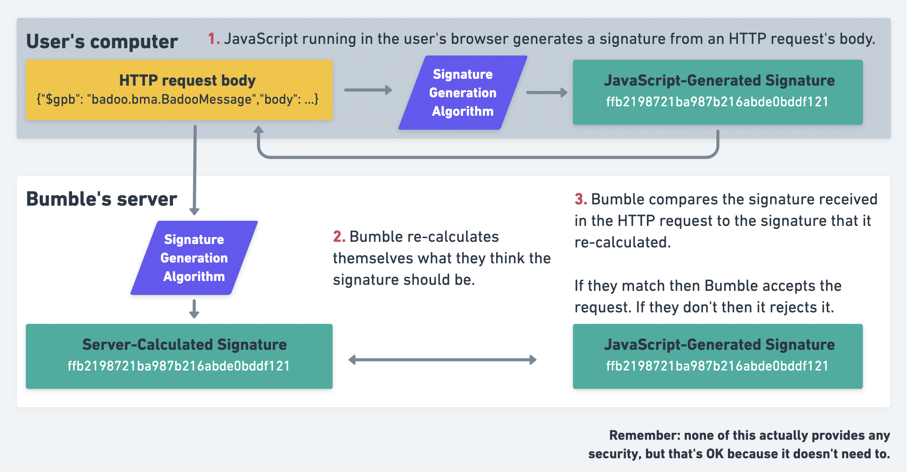
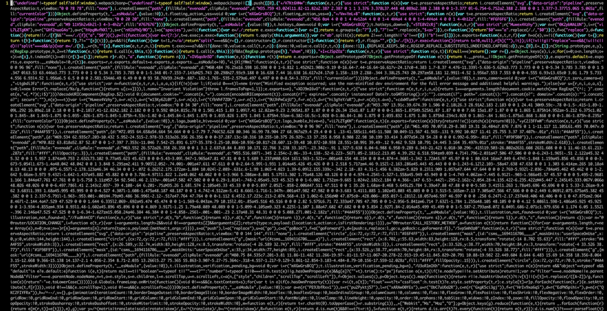
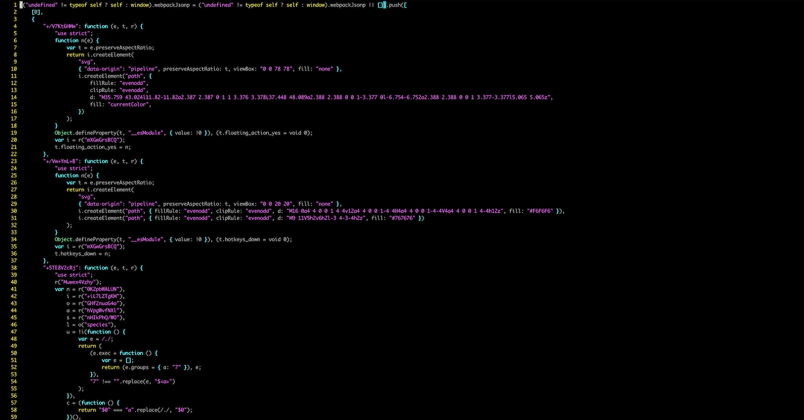
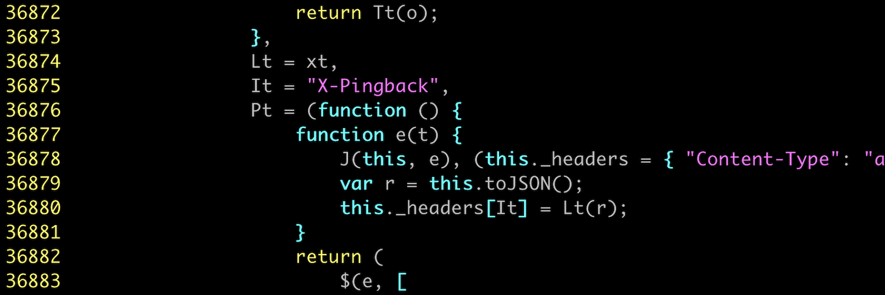
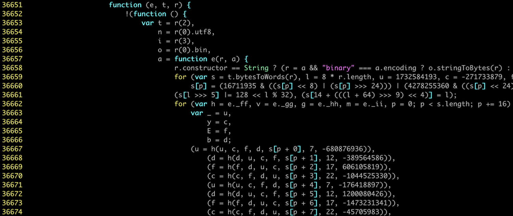
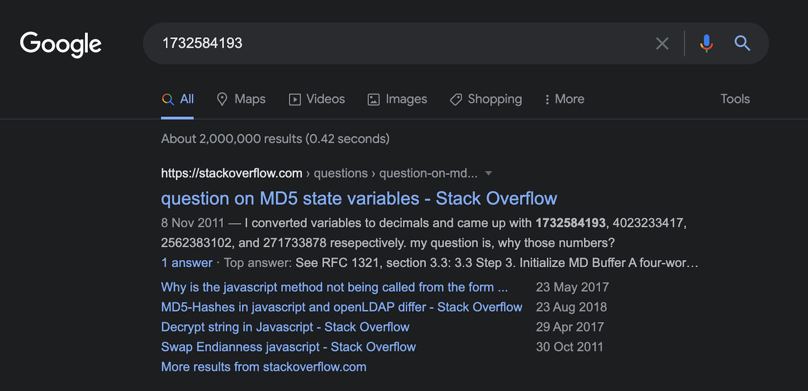
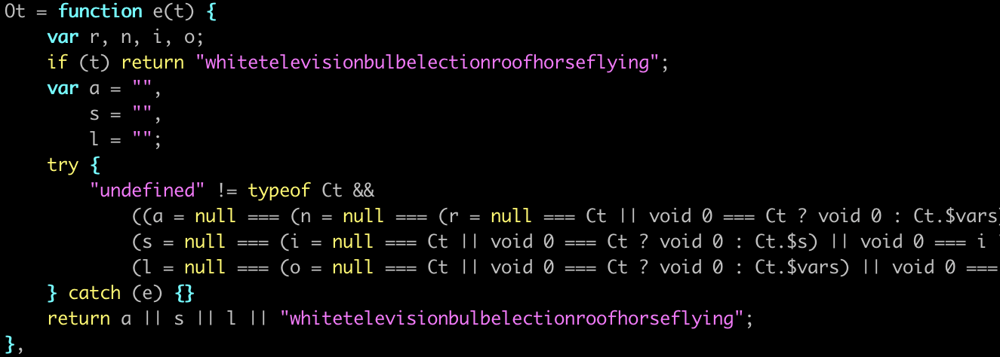

[Original Link](https://robertheaton.com/bumble-vulnerability/)

# Vulnerability in Bumble dating app reveals any user's exact location
## Introduction
We're able to use someone's Bumble account to find out where he/she is sneaking off to

## A brief history lesson
Over the years, Tinder has accidentally allowed an attacker to find the exact location of their users in several different ways.
* Until 2014, Tinder servers sent the Tinder app the exact co-ordinates of a potential match.
```
{
  "user_id": 1234567890,
  "location": {
    "latitude": 37.774904,
    "longitude": 122.419422
  }
  // ...etc...
}
```
To mitigate this attack, Tinder switched to calculating the distance between users on their server. Tinder sent these distances to the app with 15 decimal places of precision. This unnecessary precision allowed security researchers to use a technique called `trilateration` to [re-derive a victim’s almost-exact location](https://blog.includesecurity.com/2014/02/how-i-was-able-to-track-the-location-of-any-tinder-user/)
```
{
  "user_id": 1234567890,
  "distance": 5.21398760815170,
  // ...etc...
}
```


\
\
Tinder fixed this vulnerability by both calculating and rounding the distances and only ever sending their app these fully rounded values. Rounded distances can still be used to do approximate trilateration, but only to within a mile-by-mile square or so.


## Forming a hypothesis
* Problem: Bumble rounds the distance between two users, and sends only this approximate distance to the Bumble app.
* Approach: One sensible-seeming approach would be for Bumble to calculate the exact distance between two users and then round this distance to the nearest mile.
    - 3.49999 miles rounds down to 3 miles, 3.50000 rounds up to 4.
    - we can infer that this is the point at which the user is exactly 3.5 miles away from us.



#### To do
* How the Bumble app communicates with the server
* How the Bumble API works
* How to send API requests that change your location
* How to send API requests that tell you how far away another user is

It's easier to inspect traffic coming from a website than from an app, and we can use a desktop browser’s developer tools to read the JavaScript code that powers a site.

## Automating requests to the Bumble API
* Bumble API isn’t publicly documented
* We’ll use a tool called Burp Suite, it’s an HTTP proxy

This is the HTTP request when we swipe yes on someone:

```javascript
POST /mwebapi.phtml?SERVER_ENCOUNTERS_VOTE HTTP/1.1
Host: eu1.bumble.com
Cookie: CENSORED
X-Pingback: 81df75f32cf12a5272b798ed01345c1c
[[...further headers deleted for brevity...]]
Sec-Gpc: 1
Connection: close

{
  "$gpb": "badoo.bma.BadooMessage",
  "body": [
    {
      "message_type": 80,
      "server_encounters_vote": {
        "person_id": "CENSORED",
        "vote": 3,
        "vote_source": 1,
        "game_mode":0
      }
    }
  ],
  "message_id": 71,
  "message_type": 80,
  "version": 1,
  "is_background": false
}
```

This request returns a list of blurred images to display on the Beeline page. It also shows the user ID that the image belongs to.
```javascript
{
  // ...
  "users": [
    {
      "$gpb": "badoo.bma.User",
      // Jenna's user ID
      "user_id":"CENSORED",
      "projection": [340,871],
      "access_level": 30,
      "profile_photo": {
        "$gpb": "badoo.bma.Photo",
        "id": "CENSORED",
        "preview_url": "//pd2eu.bumbcdn.com/p33/hidden?euri=CENSORED",
        "large_url":"//pd2eu.bumbcdn.com/p33/hidden?euri=CENSORED",
        // ...
      }
    },
    // ...
  ]
}
```

## Forging signatures
* If we edit anything about the HTTP body of a request, even just adding an innocuous extra space at the end of it, then the edited request will fail.
    -  The request's very likely to contains something called a signature

* Before sending an HTTP request, the JavaScript running on the Bumble website must generate a signature from the request’s body and attach it to the request somehow.



#### Finding the signature in requests
* The signatures are generated by JavaScript running on the Bumble website, which executes on our computer.
    - We have access to the JavaScript code that generates the signatures, including any secret keys that may be used.
    - We can read the code, work out what it’s doing, and replicate the logic in order to generate our own signatures for our own edited requests.

* It could technically be anywhere in the request - path, headers, body - but we would guess that it’s in a header.

```javascript
POST /mwebapi.phtml?SERVER_ENCOUNTERS_VOTE HTTP/1.1
...
User-Agent: Mozilla/5.0 (Macintosh; Intel Max OS X 10_15_7) AppleWebKit/537.36 (KHTML, like Gecko) Chrome/91.0
X-Pingback: 81df75f32cf12a5272b798ed01345c1c
Content-Type: application/json
...
```
`X-Pingback` is very likely the signature

#### Reading the JavaScript
* We download Bumble’s single, giant JavaScript file onto computer


* We run it through a un-minifying tool to make it easier to read


* We search for the string X-Pingback


* We've found the function that generates the signature, on line `36,657`


* The function has contained lots of long, random-seeming, hard-coded numbers. We paste `1732584193`, the first of these numbers, into `Google`. It returns pages of results for implementations of a widely-used hash function called <strong>MD5</strong>.


* Before passing a request body into `MD5` and signing in, Bumble prefixes the body with a long string (exact value redacted), and then signs the combination of the key and string.


```javascript
const not_actually_secret_key = "REDACTED"
// Exact combination method redacted
const signature = md5(combine_somehow(not_actually_secret_key, http_body))
```

<strong>Now, we're able to send signed, authenticated, customized requests to Bumble</strong>

## Testing the attack
After some trial and error, we realize that Bumble floors distances, which means that everything is always rounded down. 
    - 3.0001, 3.4999, and 3.9999 all round down to 3; 4.0001 rounds down to 4. 

