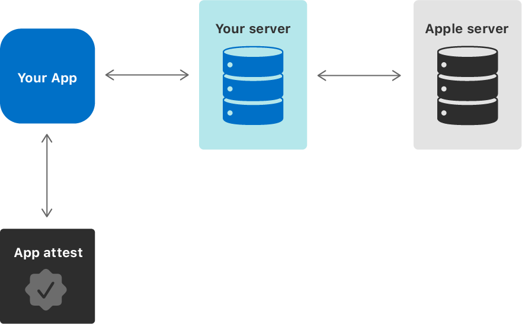

[Original Link](https://fingerprint.com/blog/local-device-fingerprint-ios/)
\
[Library](https://github.com/fingerprintjs/fingerprintjs-ios/)

# An Overview of iOS Fraud Detection APIs and Device Fingerprinting Techniques
## Introduction
This post gives an overview of the existing techniques and APIs native to iOS that allow developers to harden application security. There's also a open-source library which implemented the mentioned methods.


## Does iOS Offer Anti-Fraud Tools Out of the Box?


### iOS 11 DeviceCheck


The DeviceCheck class in iOS generates a temporary token (which Apple server will use to identify a device), then we send this token to our backend server, and then backend server will communicate with Apple's server to retrieve the bit data or update the bit data.

### iOS 14 DCAppAttestService


* For each user account on each device running your app, generate a unique, hardware-based, cryptographic key pair.

```swift
import DeviceCheck

let service = DCAppAttestService.shared
service.generateKey { (keyIdentifier, error) in
    guard error == nil else {
        return
    }
}
```

* Ask Apple to attest that what the key we're sending originated from a uncompromised version of your app. 

 ```swift
 let challenge = getSessionId().data(using: .utf8)!
let requestJSON = "{ 'requestedPremiumLevel': 300, 'sessionId': '\(challenge)' }".data(using: .utf8)!
let hash = Data(SHA256.hash(data: requestJSON))
service.generateAssertion(keyIdentifier, clientDataHash: hash) { assertion, error in
    guard error == nil else { return }
    let assertionString = assertion?.base64EncodedString()
    // Send the signed assertion to your server.
    // The server will validate it, grab your request and process it.
}
```
<strong>By implementing this in your client and in your backend, it should become harder for hackers to abuse your server's APIs.</strong> 


## Other Built-in Methods for Device Identification
#### Advertising Identifier
#### Mobile Device Management
#### Location Tracking

## Local Device Fingerprinting on iOS
 It remains possible to collect little pieces of information that are freely available on an iOS device (hardware information, disk and memory size, OS and kernel information, user settings etc.).
 
## Vendor Identifier and Keychain Storage
* No signal alone is stable enough to outlive inevitable application reinstalls and system updates. 
* The near-perfect signal: `UIDevice::identifierForVendor`
    - `identifierForVendor` value has one major drawback. The returned value changes in the extremely likely situation where all applications from a particular vendor (sharing an appId prefix) have been removed from the device.
    - Fortunately, data stored in the iOS Keychain from a particular application isn’t wiped along with it when the application gets deleted. The only exception to this rule, for now, is a factory reset (or other manual and intentional data cleanup triggered from the iOS settings).
        
## Introducing Fingerprint for iOS
#### Fingerprinter::getDeviceId()
#### Fingerprinter::getFingerprint()
Computes and returns the fingerprint from the available information on the device, currently a combination of hardware and software signals. This part is highly experimental and might not yield very accurate results.    
