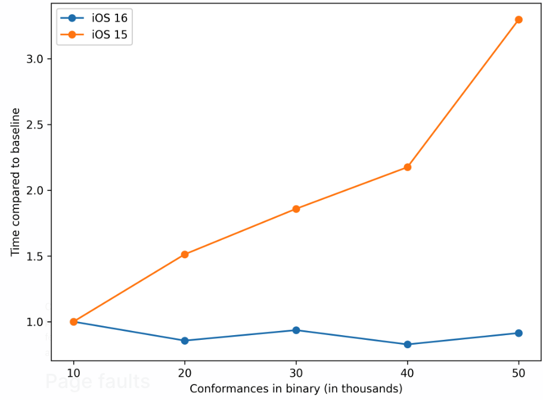

[Original Link](https://www.emergetools.com/blog/posts/iOS16LaunchTime)

# How iOS 16 makes your app launch faster
## Introduction
iOS 16 brings some big launch time improvements
* Speed up protocol checks
* Improve the time it takes to load binary by reducing the amount of data loaded from disk

These improvements come down to changes in `dyld`

## Protocol checks
* Happen in `Swift Runtime` to determine the result of code like `myVar as? MyProtocol`.
* Everytime a type conforms to a protocol, the binary will include a `conform record`. When checking a conformance, the runtime loops over every conformance record to see if any match the current operation. This loop is `O(n)` making each conformance check very slow.
* The big change comes in the `dyld closure`, which is a per-app `cache` used to accelerate various dyld operations during app launch. The close now contains `pre-computed` conformances, allowing each lookup to be much faster.

## Testing it out

## Page faults
* Big improvment comes from reducing the amount of data that has to be loaded from disk at startup.
* On app launch, some parts of the binary need to be fixed up before the code can run. On iOS 15, all fixups were done at app launch. Now a new feature called [page-in linking](https://developer.apple.com/videos/play/wwdc2022/110362/) resolves fixups lazily, only the first time a page is accessed.

## Testing it out

