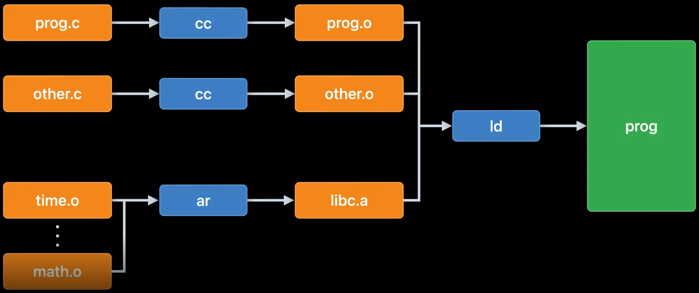
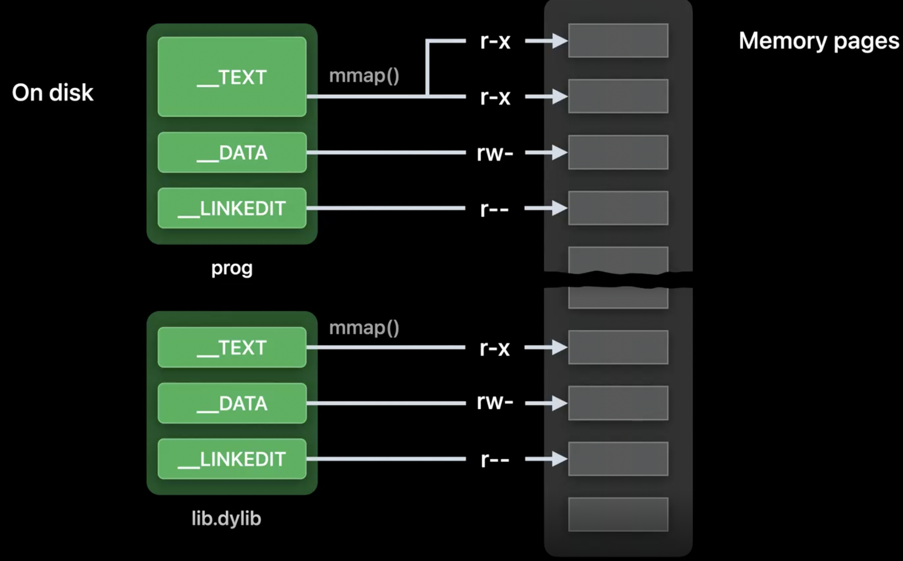
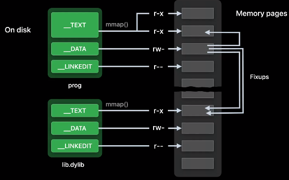
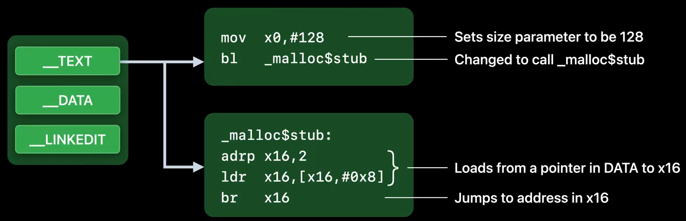
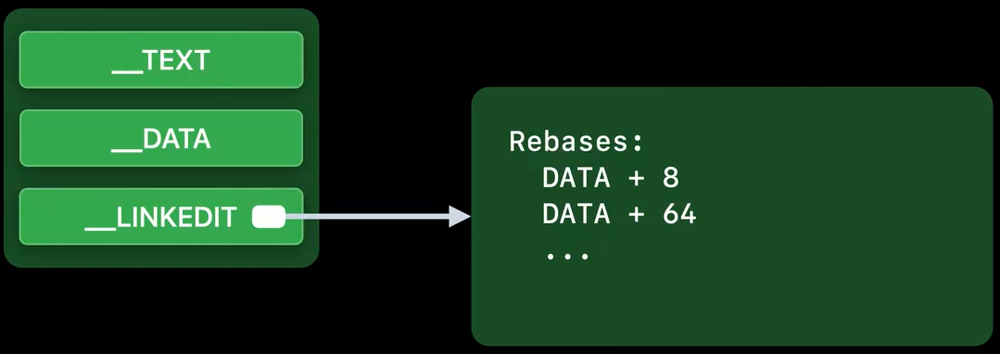
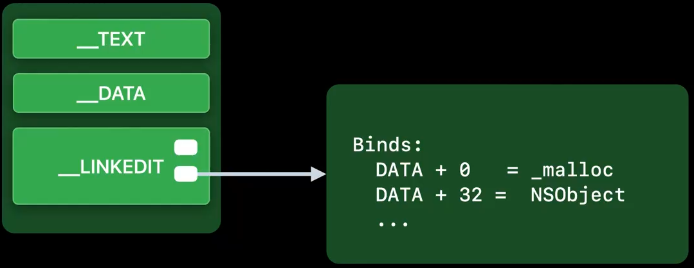
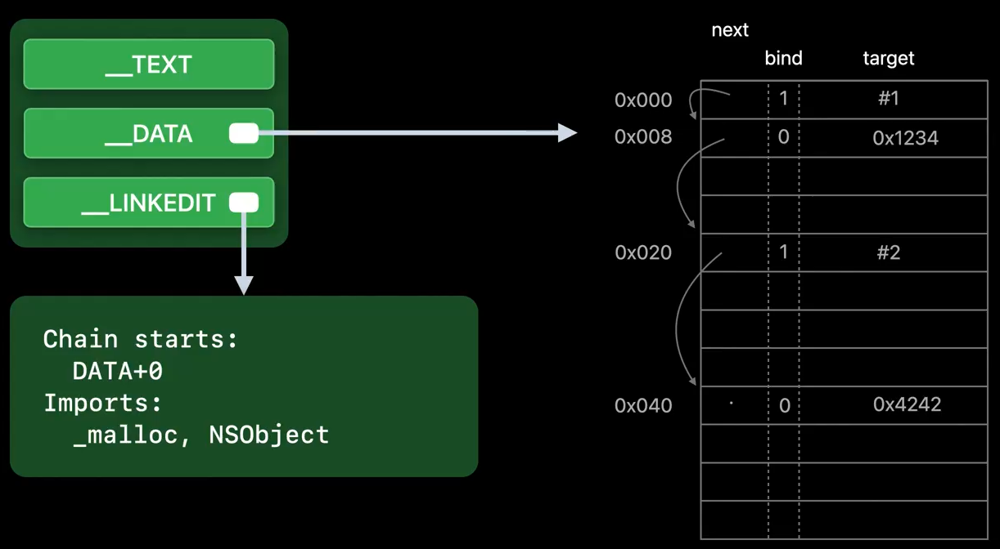
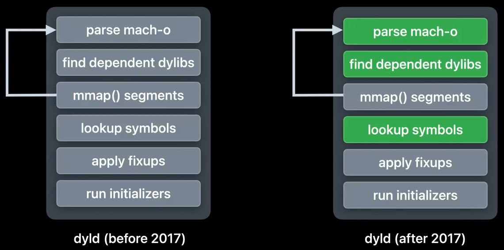
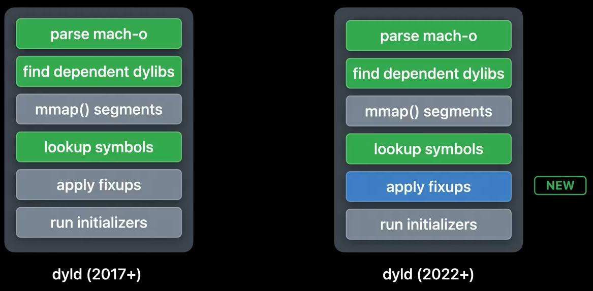

* [Original Link](https://www.wwdcnotes.com/notes/wwdc22/110362/)
* [WWDC](https://developer.apple.com/videos/play/wwdc2022/110362/)

# Link fast: Improve build and launch times
## Introduction
 Behind the scenes of linking, options, and the latest updates that improve the link performance.
 
 
## Two types of linking
#### Static
* Happens when building
* Impact both build time and app size
#### Dynamic
* Happens when app launch
* Impact launch time

## Static Linking

* `cc`: C Compile
* `relocatable object`: (`.o`) file
* `ld`: static linker 
* `ar`: archiving tool
* `.a`: static library file
* `selective loading`: only get the `.o` objects of a `.a` library that program actually needed

## Recent `Ld64` improvements
* `Ld64` is Apple's static linker
* 2x faster in XCode 14 thanks to better utilization of machine cores.

## Static Linking best practices
#### When to use?
* Code changes force static library rebuild -> Stable code is good
* Moving code under active development out of a static library -> reduce build time

#### Linker Options
`Build Settings` -> `Other Linker Flags`

#### `-all_load` (`-force_load`)
* `Selective Loading` has slows down the linker. We pass `-all_load` to ignore this behavior. 
* Make program bigger because "unused" code is now being added. To compensate for that, we can use `-dead_strip`, that will cause linker to remove unreachable code and data

#### `-no_exported_symbols`
* One part of `__LINKEDIT` segment that linker generates is an export tree which is a prefix tree that encodes all the exported symbol names, addresses, and flags
* All `dylibs` need to have exported symbols, but a main app binary usually doesn't need any exported symbols
* Trie exports are required
    - The app load plugins
    - Use XCTest with app as the host environment to run XCTest bundles
    
#### `-no_deduplicate`
* The linker merge functions that have the same instructions but different names (happens a lot due to C++ template functions)
    - Expensive algorithm: the linker has to recursively hash the instructions of every function to help look for duplicates
* XCode adds this flag for Debug builds (faster but slightly larger)
* Clang add this flag if you run clang link line with `-o0`
* For custom build, consider adding it for Debug builds 

#### Static Libraries Surprises
* Code missing in Static Library
    - Objective-C Categories and `__attribute__((used))`
* Dead stripping hide errors
    - Missing symbols called from unreachable code
    - Duplicate symbols
* Static library may be incorporated into multiple dylibs
    - Duplicate symbols at runtime
    
## Dynamic Linking
* `.dylib` 
* `ld` treats linking with a dynamic library differently
    - instead of copying, the linker just recrods a kind of `promise`
    - That is, the symbol name used from the dynamic library and what the library's path will be at runtime
    
#### Cons
* Slower launch time
Launching the app is no longer just loading one executable, but also all the associated `.dylib` which then need to be linked
* More dirty memory (`__DATA` pages)
    - With static libraries, the linker would co-locate all globals from all static libraries into the same `__DATA` pages in the main executable
    - With dynamic libraries, each library defines its own `__DATA` page
* Requires a runtime linker (dynamic linker)
`dyld` will need to fulfill the `promise` made during build time, which means it need to resolve the promised symbols to your executable

#### Inside dynamic linking

* An executable binary is divided up into segments, shuch as `__TEXT`, `__DATA`, 
* Segments are always a multiple of the page size for the OS
* Each segment has a different permission
    - `__TEXT` segment, which contains your code, has execute permissions: the CPU may treat the bytes on the page as machine code instructions
* At runtime, `dyld` has to `mmap()` the executables into memory with each segments' permissions
All the above is true for `.dylib`s as well 

## Fixups

* The main executable has various pointers to symbols belong to the `.dylib`s
* Those pointers (and other memory allocations) cannot be known until runtime

* `__TEXT` segments cannot change, these dynamic symbols/call sites becomes a call to a stub synthesized by the linker in the same `__TEXT` segment
* The stub loads a pointer from `DATA` and jumps to that location
* The secret to understanding `dyld` is that all fixups done by `dyld` are just `dyld` setting a pointer in `DATA`

## Two kind of Fixups
`__LINKEDIT` segment contains the information `dyld` needs to drive what fixups are done

#### Rebase

* When a `dylib` or `app` has a pointer that points within itself
* Needed due to `ASLR`, meaning that even internal pointers need to be rebased at app launch.

#### Binds

* Symbolic references
* Their target is a symbol name (not a number like in rebases, as those were just offets of the targets within the image)
* e.g, a pointer to function `malloc`:
    - The string `malloc` is stored in `__LINKEDIT`
    - `dyld` uses that string to look up the actual address of `malloc` in the exports trie of `libSystem.dylib`
    - Then, `dyld` stores that value in the location specified by the bind
    
## Chained fixups

* Makes `__LINKEDIT` smaller
* Instead of storing all the fixup locations, `__LINKEDIT` stores just where the first fixup location is in each `__DATA` page, as well as a list of the imported symbols
* The rest of the info is encoded in `__DATA`
* It's called chained because, in the 64 bit pointer location in `__DATA`, some of the bits contains the offset to the next fixup location (hence we jump from fixup to fixup in a chain-like manner). There is a bit that says if the fixup is a bind or a rebase:
    - If it's a bind, the rest of the bits are the index of the symbol
    - It it's a rebase, the rest of the bits are the offset of the target
* Supported when deploying to iOS 13.4 and later

## How dyld works

* `dyld` starts with the main executable, and it parses the `match-of` find the dependent `dylib`s (the `promised` dynamic libraries your executable needs to run)
* For each `.dylib`, `dyld` finds them and `nmap()`s them
* Then `dyld` does step 1-2 recursively for each `.dylib`
* Once everything is loaded, `dyld` looks up all the bind symbols needed
* Once the looku is completed, `dyld` uses those addresses when applying fixups
* Once all fixups are done, `dyld` runs initializers, bottom up 

Since 2017, green steps are cached, as they're the same at every app launch (they need to be redone only on app/OS updates)

## Page-in linking

* `dyld` no longer applies fixups to all `dylib`s at launch
* instead, the kernel applies fixups to your `__DATA` pages lazily, on page-in
    - It has always been the case that the first use of some address in some page of an `nmap()`ed region triggered the kernel to read in that page
    - But now, if it's a `DATA` page, the kernel will also apply the fixup that page needs
* Pros
    - Reduces dirty memory
    - Reduces launch time
    - `DATA_CONST` pages are clean
* Available in iOS 16, MacOS 13, and WatchOS 9
* Only works for binaries built with chained fixups 
    - Because with chained fixups, most of the fixup information will be encoded in `DATA` segment on disk, which means it is available to the kernel during page-in
* `dyld` only uses this mechanism during launch, any `dylib`s `dlopen()`ed later do not get page-in linking. In that case, `dyld` takes the traditional path and applies the fixups during the `dlopen` call
    
## Dynamic linking best practices
* Use fewer `dylib`s
* Optimize or eliminate static initializers (code that always runs `pre-main`)
* Find sweet spot for statc and dynamic libraries 
* Use chained fixups (iOS 13.4 or later)

## New Tools
#### `dyld_usage`
* Get a trace of what `dyld` is doing
* The tool is only on MacOS, but you can use it to trace your app launching in simulator (or if your app built for Mac Catalyst)

#### `dyld_info`
* Inspect binaries, both on disk and in the current `dyld` cache 
* Can show info about `mach-o` files and `dylib`s in the `dyld` cache
* View the exports (will show all the exported symbols in the `dylib`, and the offset of each symbol from the start of `dylib`)
* View the fixups 
