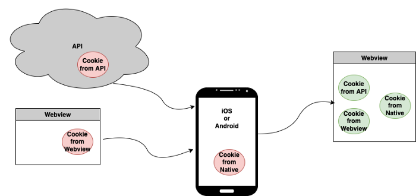
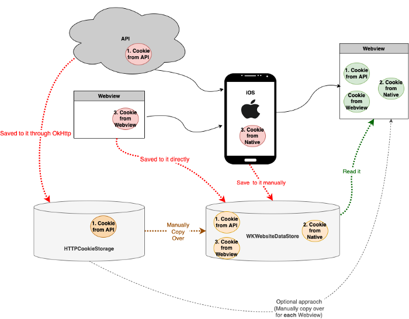

[Original Link](https://medium.com/mobile-app-development-publication/sync-cookies-across-webviews-and-native-app-for-ios-and-android-f2ed5ac79f32)

# Sync Cookies Across Webviews and Native App for iOS and Android
## Introduction
Enable WebViews to be Sync with Native App through Cookies  

## Three Options
* URL Query Parameters (only one way communication) 
* JSBridge 
* Cookies 

## Cookies


* Access cookie from an API and share with a WebView 
* Access cookie from an WebView and share with another WebView
* Creete a cookie from an NativeApp and share with a WebView

## iOS Cookies Sync


#### Cookie From API Service to WebView
```swift
let request = URLRequest(
    url: URL.localApiServer, 
    cachePolicy: .useProtocolCachePolicy, 
    timeoutInterval: 10
)
let session = URLSession.shared
session.configuration.httpCookieAcceptPolicy = .always
session.configuration.httpCookieStorage = HTTPCookieStorage.shared
session.configuration.httpShouldSetCookies = true
```
However, these cookies cannot be accessed by WKWebView. So, we have 2 options
* A: Manually copy over for each WKWebView
```swift
let cookies = HTTPCookieStorage.shared.cookies ?? []
for (cookie) in cookies {         
    webView.configuration.websiteDataStore.httpCookieStore
        .setCookie(cookie)
}
let request = URLRequest(url: url)
webView.load(request)
```
* B: Manually copy over to WKWebsiteDataStore
The `WKWebsiteDataStore` store cookies that can be accessed by all WKWebview.
```swift
let dataTask = session.dataTask(with: request) { 
    (data, response, error) in
    if error == nil {
      print("Success fetch!")
      guard
          let url = response?.url,
          let httpResponse = response as? HTTPURLResponse,
          let fields = httpResponse.allHeaderFields as? 
            [String: String]
      else { return }
      let cookies = HTTPCookie.cookies(
         withResponseHeaderFields: fields, for: url)
      HTTPCookieStorage.shared.setCookies(
         cookies, for: url, mainDocumentURL: nil)
      for cookie in cookies {
          var cookieProperties = [HTTPCookiePropertyKey: Any]()
          cookieProperties[.name] = cookie.name
          cookieProperties[.value] = cookie.value
          cookieProperties[.domain] = cookie.domain
          cookieProperties[.path] = cookie.path
          cookieProperties[.version] = cookie.version
          cookieProperties[.expires] = 
             Date().addingTimeInterval(31536000)
          let newCookie = HTTPCookie(properties: cookieProperties)
          // Need to be on the main thread
          DispatchQueue.main.async {
             WKWebsiteDataStore.default()
                .httpCookieStore
                .setCookie(newCookie!, completionHandler: nil)
          }
      }
}
```

#### Cookie from Native App to WebView
Manually create the cookie and save it in `WKWebsiteDataStore`.
```swift
let cookieName = "native-cookie-set-key"
let cookieValue = "this-is-set-by-native"
var cookieProperties = [HTTPCookiePropertyKey: Any]()
cookieProperties[.name] = cookieName
cookieProperties[.value] = cookieValue
cookieProperties[.domain] = "127.0.0.1"
cookieProperties[.path] = ""
cookieProperties[.expires] = Date().addingTimeInterval(31536000)
let newCookie = HTTPCookie(properties: cookieProperties)
WKWebsiteDataStore.default().httpCookieStore.setCookie(
    newCookie!, completionHandler: {}
)
```

#### Cookie from WebView to another WebView
Nothing needed to be done here, as all WebViews are accessing and sharing the same `WKWebsiteDataStore`

#### Note for Safari Controller
The cookis are not shared between App and Safari, we cannot pass cookies over
