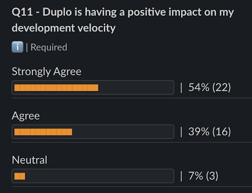
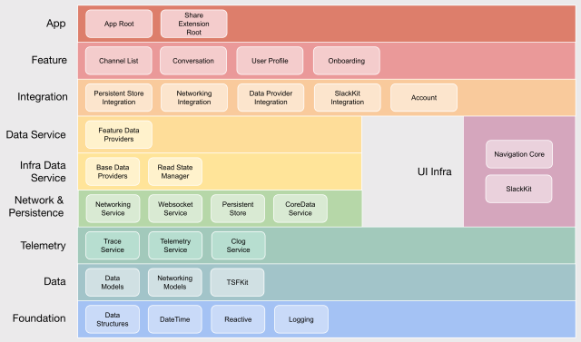

[Original Link](https://slack.engineering/scaling-slacks-mobile-codebases-modernization/)

# Scaling Slack’s Mobile Codebases: Modernization
## Introduction
This post will discuss Slack's Modernization, and look at the overall results and impact on developers.

## Modernization
* Improve overall app architecture
* Keeping up with industry trends
* Adopt more forward-looking design patterns and technologies

## iOS Modernization
#### Feature architecture
* `MVVM+C` feature architecture, but found it wasn’t opinionated enough
* Settled on their own variant of `VIPER (View, Interactor, Presenter, Entity, and Router).` 

#### Stricter linting
* Prevent the use of a number of anti-patterns which were common in legacy code
* They were already running Swiftlint on every commit, but decided to impose stricter linting rules and additional lint errors on the directories containing `modern` modules. 
* Examples:
    - Use of `global singletons` like static let shared: 
        - Any globally scoped objects to be injected through `interfaces` rather than accessed as `singletons`
    - Use of `Notifications/NotificationCenter` 
        - Preferred to use `Combine publishers/subscribers`
    - Accessing `UIViewController.topPresented` or `.topMostPresentedViewControllerInStack`
        - Accessing these properties in the view hierarchy directly broke feature composition and navigation 
    - Use of many `UIKit` components
        - Preferred their own `SlackKit UI` components

#### Combine adoption
* They had already been using a limited in-house implementation of certain reactive programming concepts
* Adopted Combine 
    - In feature architecture, when streaming updates from data providers
    - Replace notifications and observers where they could
* `Combine` only support `iOS 13` and higher
    - They temporarily adopted the open source `CombineX` framework, which allowed them to use Combine syntax and functionality
    
#### SlackKit
* Slack’s cross-platform shared UI design system
* There were still many screens which were using `legacy UI` components rather than `SlackKit` ones.

## Duplo results
* <strong>iOS</strong>
    - Codebase: <strong>68%</strong> Modernizedand <strong>81%</strong> Modularized
    - <strong>280</strong> modules were added
    - CI build stability improved from <strong>77%</strong> to <strong>90%</strong>, year over year
    - Average CI Time To Merge was reduced by <strong>64%</strong>, and the p95 dropped by <strong>63%</strong>

#### Developer sentiment
* At Slack, `Mobile Developer Experience` team conducts quarterly surveys of mobile developers, to track trends in developer opinions about the codebase and development processes. 

## Next steps
#### Interdependencies between modules
* Original rules around modularization were not strict enough
    - Any of Library modules could depend on any others, and any Library could also depend on any Service and Feature Interface.
    - Lower-level modules depending on higher ones, and circular dependencies among modules.
* They needed to define `Layers` for modules: `Foundation`, `Data Models`, `Networking`, etc.
 

#### Dependency Injection
* Had a number of large dependencies classes, which were passed around through many levels of code
    - It easy to create circular dependencies and memory leaks
    - hard to tell which dependencies were actually in use
* After investigating a number of possibilities, including third-party frameworks
    - They decided to stick with standard initializer injection
        - Simple to adopt
        - Familiar to developers
        - Provided a compile-time guarantee that dependencies were valid
        - Avoided global state or singletons
* This is area where they want to make additional improvements
    - Feature and Service Implementation modules are only linked by the app target
    - This means the app target is still larger and more unwieldy
    - Adoption [Needle](https://github.com/uber/needle) as a dependency framework
        - Enable modules to explicitly define their dependencies 
        - Build them without having to link all the implementations in the app target.
