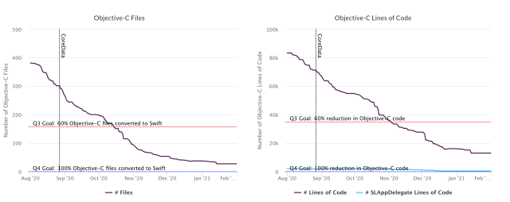

[Original Link](https://slack.engineering/stabilize-modularize-modernize-scaling-slacks-mobile-codebases/)

# Stabilize, Modularize, Modernize: Scaling Slack’s Mobile Codebases
## Introduction
This post is about the process of improving and scaling Slack's mobile codebases (both iOS/Android). It consists of
* Stabilization
* Modularization
* Modernization

## Background
The iOS codebase hadn't had a major rewrite since it was created in 2013. In addition to widespread tech debt, they needed to rethink the overall feature and application architecture.

## Techdebt
* Most of the code was in large, monolithic app targets.
    - Any changes to code required time consuming rebuilds
    - There wasn't clear separation between components
* There was a lot of Objective-C code.
* A lack of strict conventions in many areas:
    - MVVM+C feature architecture, but it wasn't universally adopted. This meant each feature was implemented slightly differently, which led to confusion.

## Rewrite or Refactor?
* Rewrite
    - Highly risky option
    - Could waste a huge amount of time and resources
    - Require reimplementing legacy features, which would be a massive effort.
* Cross platform
    - There are some clear benefits
    - Performance issues
    - Complications with debugging and tooling
* Refactor
    - Minimize risk
    - Avoid having to maintaing separate codebases.
    - Had to migrate legacy code and re-architect the apps in place, while keeping the app shippable and continuing development of new features.

## Project Duplo
A coordinated effort across iOS and Android
* Goals
    - Reduce tech debt
    - Improve development velocity
    - Adopt more modern design patterns and technologies
    - Get codebase ready for the next five years of development
* Proposal focused on:
    - How the issues could be addresses
    - How measure progress
    - What failure modes would be most likely at each phase of the project
    
The themes (iOS and Android) were the same:
* <strong>Stabilization</strong>    
* <strong>Modularization</strong>    
* <strong>Modernization</strong>    

## Stabilization
#### iOS goals
* Port remaining Objective-C code to Swift
    - 80,000 lines of Objective-C
    - Using both Objective-C and Swift in frameworks also increased build times
* Finish migrating to data access libraries
    - There were still many places in the legacy code which accessed CoreData directly
* Finish migrating to native networking library
    - In some places, they were still using a third-party library.
    - Having two separate implementations also made it harder to add support for new networking features, like analytics, or priorities for API requests.

## Metrics
* For some parts of project
    - Breaking the work down into tasks which could be collectively tracked in Jira
    - It didn't give them a very good measure of their progress in completing large migrations.
* On iOS
    - Using automated scripts to track progress on each of Stabilization goals    
    - For Objective-C to Swift conversion, the scripts could just search for remaining Objective-C files

## Stabilization complete
It took 6 months to complete Duplo project
* Removing Objective-C and moving to 100 Swift
* Completing the migration onto internal data frameworks
* Fully moving onto their networking library
