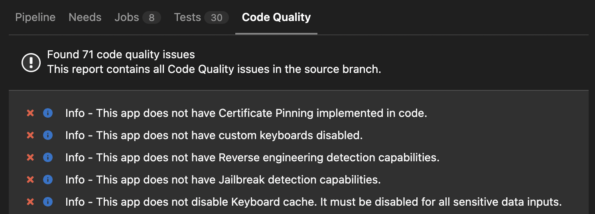

[Original Link](https://benoitpasquier.com/2022/07/security-application-static-analysis-applied-to-ios-and-gitlab-ci/)

# Security Application Static Analysis applied to iOS and Gitlab CI
## Introduction
Introduce `Mobsfscan` and how to integrate it into `CI/CD`

## Security in Mobile Application
[Mobile Security Testing Guide](https://owasp.org/www-project-mobile-app-security/)
* A fundamental learning resource covering a variety of topics from mobile OS internals to advanced reverse engineering techniques.

## Application Security Testing
* Static Application Security Testing (SAST)
    - It’s pretty similar to any lint tools, like SwiftLint, but applied to security issues.
    
* `Mobsfscan`

## Integration with Gitlab

