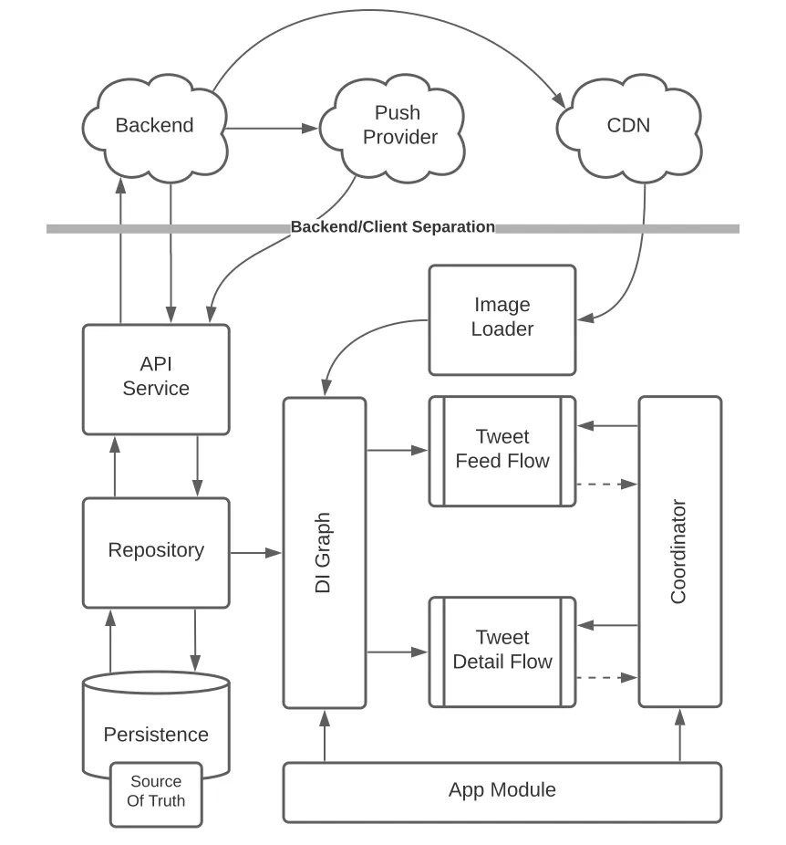
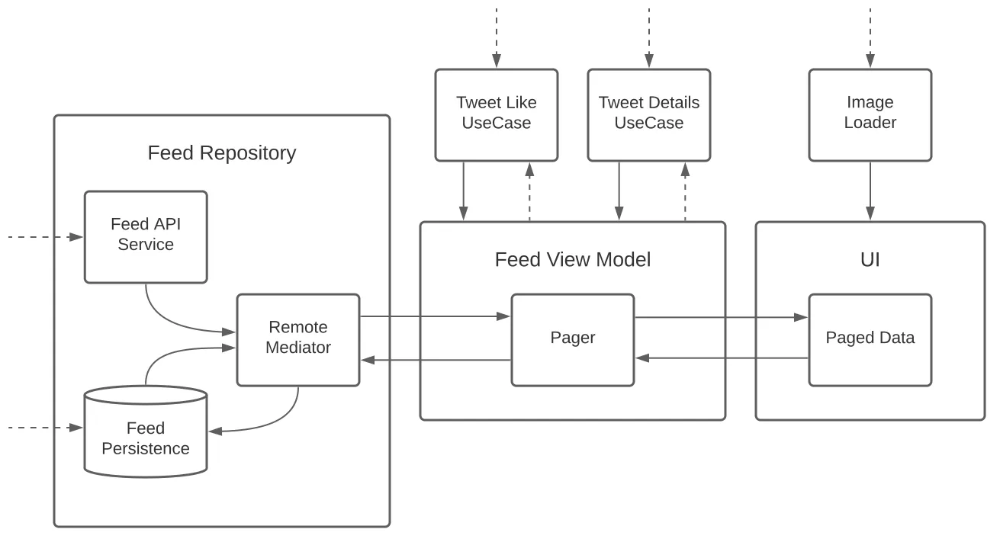

[Original Link](https://proandroiddev.com/a-simple-framework-for-mobile-system-design-interviews-89f6f4134b84)

# A Simple Framework For Mobile System Design Interviews
## Introduction
Solution for interview question "Design Twitter Feed" as a mobile developer.

## Defining the tasks
* __Client-side only:__ Already had backend and APIs available
* __Client-side + APIs:__ Need to design a client app and API.
* __Client-side + APIs + Backend:__ Less likely choice

## Gathering Requirements
#### Functional requirements
Think about
* Users should be able to scroll through an infinite list of tweets.
* Users should be able to like a tweet.
* Users should be able to open a tweet and see comments (read-only).

#### Non-functional requirements
* Offline support.
* Real-time notifications.
* Optimal bandwidth and CPU/Battery usage.

#### Out of scope
* Login/Authentication.
* Tweet sending.
* Followers/Retweets.
* Analytics.

#### Providing the “signal”
* What assumptions did you make and how did you state them?
* What features did you choose?
* What clarifying questions did you ask?
* What concerns and trade-offs did you mention?

Your best bet is to ask many questions and cover as much ground as possible.

## Clarifying Questions
#### Do we need to support Emerging Markets?
The app size should be as small as possible due to the widespread use of low-end devices and the higher cost of cellular traffic. 

#### What number of users do we expect?
A large number of clients results in a higher back-end load

#### How big is the engineering team?
The major concern is project structure and modularization.

## High-Level Diagram


#### Server-side components:
* __Backend__
* __Push Provider__
* __CND__

#### Client-side components:
* __API Service__
* __Persistence__
* __Repository__
* __Tweet Feed Flow__
* __Tweet Details Flow__
* __DI Graph__
* __Image Loader__
* __Coordinator__
* __App Module__

## Deep Dive: Tweet Feed Flow
Think about
* __Architecture patterns__
    - MVP, MVVM, MVI, etc. MVC is considered a poor choice these days.
* __Pagination__
* __Dependency injection__
* __Image Loading__
    - Low-res vs full-res image loading, scrolling performance, etc.

#### Components


* __Feed API Service:__ Injected via DI-graph
* __Feed Persistence:__ Injected via DI-graph
* __Remote Mediator__ 
    - Triggers fetching the next/prev page of data
    - Redirects the newly fetched paged response into a persistence layer.
* __Feed Repository__ 
    - Consolidates remote and cached responses into a Pager object through Remote Mediator.
* __Pager__
    - Trigger data fetching from the Remote Mediator 
    - Exposes an observable stream of paged data to UI.
* __“Tweet Like” and “Tweet Details” use cases__
    - Provide delegated implementation for “Like” and “Show Details” operations.
    - Injected via DI-graph
* __Image Loader__
    - Abstracts image loading from the image loading library
    - Injected via DI-graph

#### Providing the “signal”
* The candidate is familiar with the most common MVx patterns.
* The candidate achieves a clear separation between business logic and UI.
* The candidate is familiar with dependency injection methods.
* The candidate is capable of designing self-contained isolated modules.

## API Design
* Just ask the interviewer if they are particularly interested in a specific part,
* Or choose something you know best (in case they don’t have a strong preference).
 
#### Real-time notifications
* __Push Notifications__

* __HTTP-polling__

* __Short HTTP-polling__

* __Long HTTP-polling__

* __Server-Sent Events__

* __Web-Sockets__

#### Protocols
* __REST__

* __GraphQL__

* __WebSocket__

* __gRPC__

#### Pagination
* __Offset Pagination__

* __Keyset Pagination__

* __Cursor/Seek Pagination__

 A sample API request
 ```json
GET /v1/feed?after_id=p1234xzy&limit=20
Authorization: Bearer <token>
{
  "data": {
    "items": [
      {
        "id": "t123",
        "author_id": "a123",
        "title": "Title",
        "description": "Description",
        "likes": 12345,
        "comments": 10,
        "attachments": {
          "media": [
            {
              "image_url": "https://static.cdn.com/image1234.webp",
              "thumb_url": "https://static.cdn.com/thumb1234.webp"
            },
            ...
          ]
        },
        "created_at": "2021-05-25T17:59:59.000Z"
      },
      ...
    ]
  },
  "cursor": {
    "count": 20,
    "next_id": "p1235xzy",
    "prev_id": null
  }
}
 ```

#### Authentication
* We can include __theAuthorization__ header 
* Discuss how to properly handle __401 Unauthorized__ response scenarios.

#### Providing the “signal”
* The candidate is aware of the challenges related to poor network conditions and expensive traffic.
* The candidate is familiar with the most common protocols for unidirectional and bi-directional communication.
* The candidate is familiar with REST-full API design.
* The candidate is familiar with authentication and security best practices.
* The candidate is familiar with network error handling and rate-limiting.

## Data Storage
#### Key-Value Storage (UserDefaults/SharedPreferences/Property Lists)

#### Database/ORM (Sqlite/Room/Core Data/Realm/etc)

#### Custom/Binary (DataStore/NSCoding/Codable/etc)


#### On-Device Secure Storage (Keystore/Key Chain)

#### Storage Location
* __Internal:__ Sand-boxed by the app
* __External:__ Publicly visible and most likely not deleted when your app is deleted.
* __Media/Scoped:__ A special type of storage for media files.

#### Storage Type
* __Documents (Automatically Backed Up):__ 
    - User-generated data 
    - Cannot be easily re-generated and will be automatically backed up.
* __Cache__ 
    - Can be downloaded again or regenerated
    - Can be deleted by the user to free-up space
* __Temp:__ Is only used temporarily and should be deleted when no longer needed.

#### Best Practices
* Store as little sensitive data as possible.
* Use encrypted storage if you can’t avoid storing sensitive data.
* Make sure that cleaning up cached files won’t affect app functionality.

#### Providing the “signal”
* The candidate is aware of mobile storage types, security, limitations, and compatibility.
* The candidate is capable of designing a storage solution for the most common scenarios.


