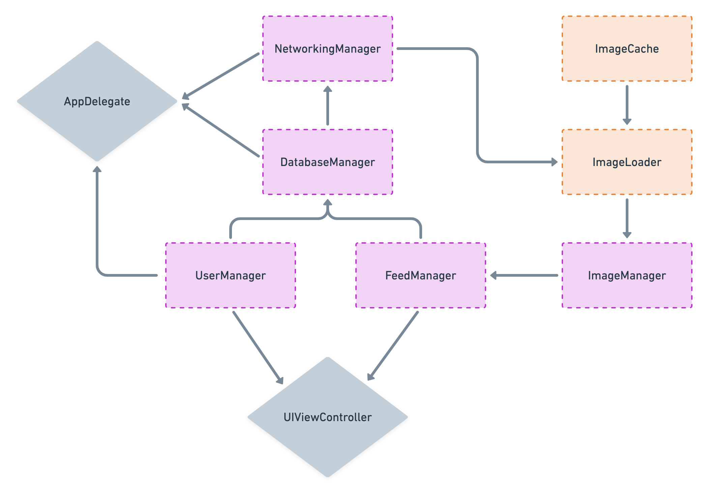

[Original Link](https://www.davidseek.com/fb/)

# How I would solve the Facebook iOS App Design Interview
## Introduction
When sitting in an interview and being asked to "design Instagram"


## Clarification
* **What part should I design?**
    - Authentication
    - Feed
    - User Profile
    - Messaging
    - Post comments

* **If messaging**
    - What kind of attachments? 
        - **Image**: consider caching
        - **Location**: consider map performance 

* **Is it okay to assume a Firebase Backend?**

Application Design for the **Instagram Home Feed** – so images and their meta-data.

## Basic and most common requirements
* **Scalabity**
    - Be able to serve countless users
    - Handle an excessive amount of content all over the world
    
* **Security**
    - High industry security standard
    - In terms of authentication, networking and data storage
    
* **High Velocity Development**
    - Support many users, as well as, many engineers
    - Lay out the foundation for a scalable code architecture 
    - Can support thousands of commits a day
    
* **Separation of Concerns**
    - Services and managers that are easily interchangeable 
    - Be concerned about only themselves.

## Overview


Many interviewers like to talk about image loading and caching

```swift
enum Image { // 1
  case image(UIImage)
  case thumbnail(UIImage)
}

enum LoaderResult { // 2
  case success(Image)
  case failure(Error)
}

class ImageLoader { // 3
  func getImage(from url: String, onLoad: @escaping ((LoaderResult) -> Void))
}

```

## Scalability
* **Cache data locally**
    - Hundreds of millions of requests are not unnecessarily overloading the backend system
* **Define an application architecture**   
    - Supports adding new functionality and fixing bugs by countless engineers
    - While supporting an extraordinary "speed to customer".
    
* **Example of DatabaseManager**
    - Must utilize some kind of a pagination or cursor controlled approach
    - Download 30 items at a time, while pre-rendering 20 for a low latency, and continuing with the "next page" when scrolling.
* **Throttling**
    - A 3-second limit on the "pull-to-refresh" action
    - Decrease unnecessary load on the backend.    
    
* **Caching image**

## Security
* **Best practice concepts**
    - Won't store sensitive information in UserDefaults
    - One trick to safely secure API keys is to utilize a private CloudKit database
    - A good practice to securely store Secrets
        - utilize a *.xcconfig* configuration file
        - ignore the file using a *.gitignore*
        - you're not exposing Secrets in your repository

## Caching
#### Example of User Profile
* Download information to display it
* The cache will now have this information
* Display the profile instantly when requested
* While presenting the new controller, a request updates the information

#### How much data is stored in the cache?
* **LRU - Least Recently Used**

## Offline support
#### Instagram Example
* User Authentication and the stored user model supports offline availability
* The feed items the user saw last

#### Offline Database
```swift
class DatabaseManager { // 1
  private let offlineDatabase = OfflineDatabase() // 2
  private let onlineDatabase = OnlineDatabase() // 3
  
  public func query(_ path: QueryPath, onLoad: @escaping (DatabaseResult) -> Void) { // 4
    offlineDatabase.observe(path) { result in  // 5
      onLoad(result)
    }
    
    onlineDatabase.query(path) { result in // 6
      offlineDatabase.store(result, forQueryAt: path)
    }
  }
  
  public func store(_ payload: Payload, forQueryAt path: QueryPath) {
    offlineDatabase.store(payload, forQueryAt: path { scheduler in
      // 7
    }
  }
}

private class OfflineDatabase {
  public func observe(_ path: QueryPath, onComplete: @escaping (DatabaseResult) -> Void)
  public func store(_ payload: Payload, forQueryAt path: QueryPath, onStore: ((SchedulerResults) -> Void)? = nil)
}
```

* Observe the offline database and forward the information to the closure, down to the consumers.
* Then, we're using the online database, to update the offline database.
* We're observing on the offline database, new information will automatically be forwarded to the consumers.
