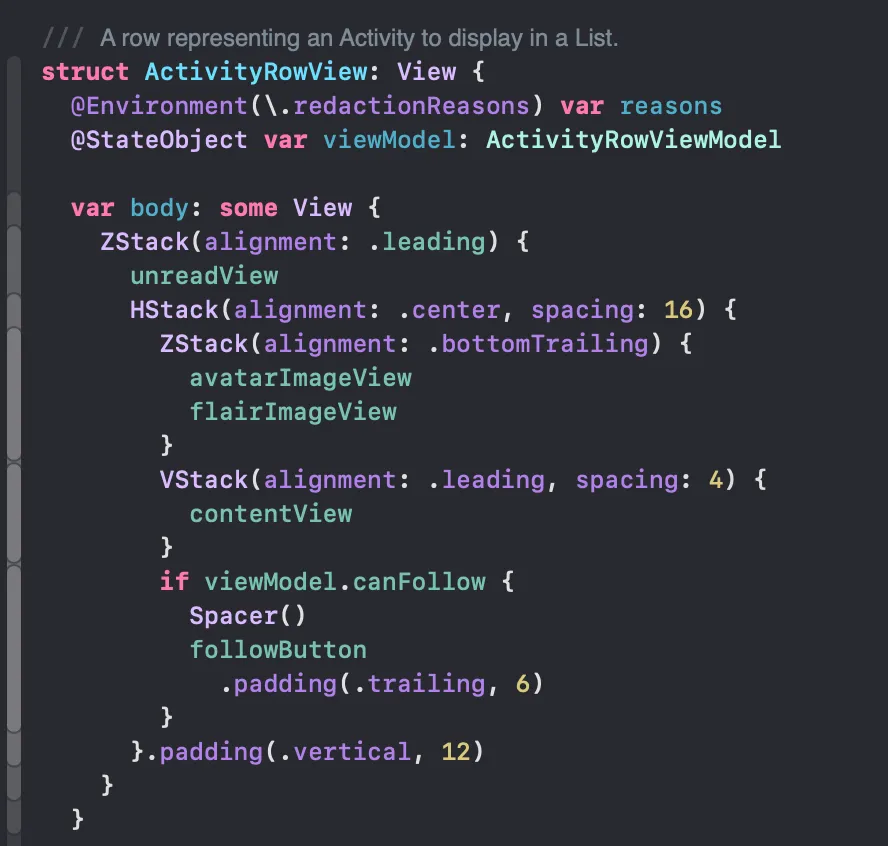

[Origin](https://medium.engineering/evolution-of-the-medium-ios-app-architecture-8b6090f4508e)

# Evolution of the Medium iOS app architecture
## Introduction
Transition from a monolithic architecture to a package-based one.

## Swift Packages
* Split the codebase into two proper Swift packages:
    - Model 
    - Features

* Model and Features define several different library products. 

* **package.swift**

## Model package
* Modern Medium API is built on GraphQL
* **ApolloModels** product, this is where all the code generated by the Apollo client from our **schema.graphql** live
* Old API is sharing models with clients using protobuf

### Legacy REST API client 

### Modern GraphQL client 

 All these dependencies are available using **env**

### Env

 
 Its goal is to replace the way we were doing **dependencies injection** with something **simpler**.
  
### Navigator
* Medium iOS project has a centralised navigation at the app level
    - When making packages, we don’t have access to app level features.
    - For a long time, we were using closures to forward navigation decisions to the app level. 
    - For large features with many navigation options, this was not cutting it anymore.

#### At Package level

#### At App level

* Implement *go* function and forward every case of Destination to App level navigator.
* Features are also able to do local navigation, especially with SwiftUI

### Feature package
* Fully self contained features (including GQL queries and protocol extensions over GQL type)

* GraphQL part needs to live close to the features
    - Queries, mutations and fragment should be tailored to exactly what we need for the feature we’re working on
* How we work with GraphQL: a protocol which describes what we need for the feature:

#### ViewModel

#### View

#### en & navigator used in ViewModel

#### Service
Service used in Feature Package but has some dependencies

And we can change easily or mock/fake for Unit Testing

### SwiftUI
* Medium for iOS supports only iOS 14 & 15
* Swift previews + Swift package allow us to iterate quickly
* Swapping the whole implementation is a matter of seconds in SwiftUI in contrast to UIKit 
* Issues with SwiftUI:
    -  Its behaviour between iOS 14 & 15 is quite different for the same components
    

