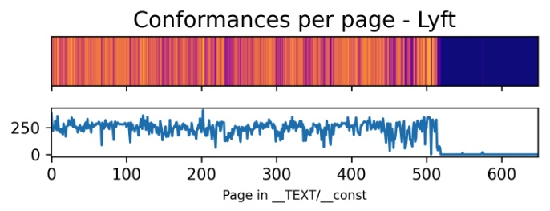
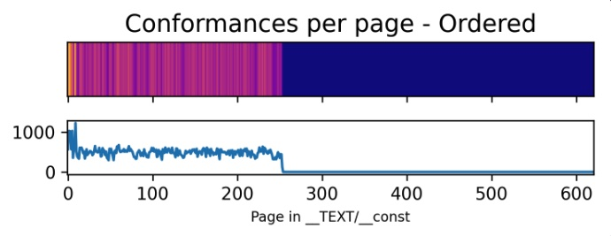

[Origin](https://www.emergetools.com/blog/posts/how-order-files-speed-up-protocols)

# How To Speed Up Swift By Ordering Conformances
## Introduction
This post is about how we speed up Swift Code by applying ordering conformances

## iOS 16 improvement of checking protocol conformance
* Records of every conformance get stored in the `__TEXT/__const` section of the binary
```swift
struct ProtocolConformanceDescriptor {
  // Offset to the protocol definition
  let protocolDescriptor: Int32
  // Offset to the type that conforms to the protocol
  var nominalTypeDescriptor: Int32
  let protocolWitnessTable: Int32
  let conformanceFlags: UInt32
}
```
* When the Swift runtime encounters something like `myVar as? MyProtocol`, it loops over every `ProtocolConformanceDescriptor` in the binary plus any dynamically linked binaries.

#### iOS 16 Improvement
* iOS 16 precomputes protocol conformances in the `dyld closure`, which is a per-app cache 
* The closure now contains pre-computed conformances, allowing each lookup to be much faster.
* There are still 3 cases where you might encounter the slow lookup:
    - On the first launch after an app install/update, the dyld closure isn’t built yet.    
    - `_dyld_protocol_conformance_result_kind_definitive_failure`, but a quick scan of the source code reveals this is not yet implemented.
    - You aren’t using iOS 16.
 
## Order files
* Order files are inputs to the linker which make apps faster by grouping code used together into the same region of the binary.
* Your app accesses only the memory used by the app launch code rather than reading an entire 100+ MB binary into memory.

## Ordering conformances
* By default, protocol conformances end up spread throughout the `__TEXT/__const` section of the binary.
* We can apply the idea of using order files to group data onto as few pages as possible to conformances, and generate an order file that moves all conformances onto their own pages.
* You can set the Xcode `Order File` build setting to the path of this file

## Demo
#### Conformances of Lyft app

\
Conformances in each binary page of Lyft’s `__TEXT/__const` section. The y-axis shown the number of conformances on each page. The top figure is a heatmap of conformance counts.

#### Conformances of Lyft app - Ordered

\
Conformances ordered to the beginning of the `__TEXT/__const` section
