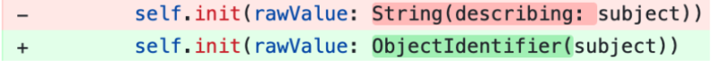
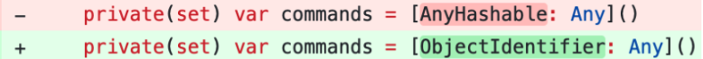
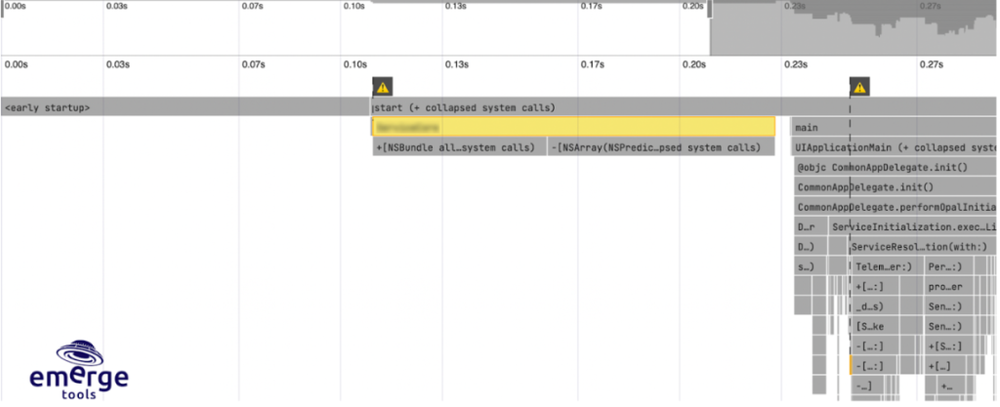
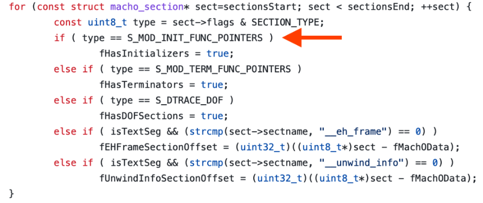
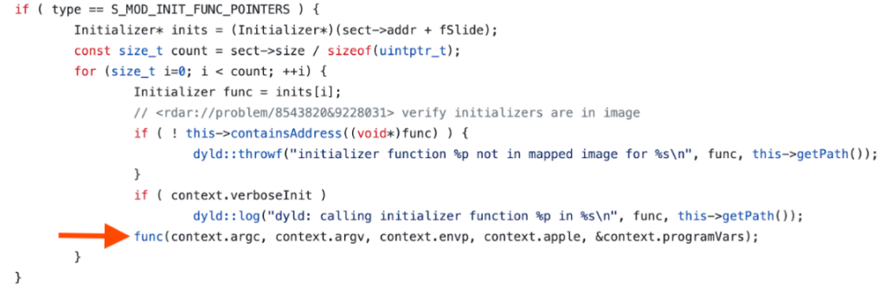

[Origin](https://doordash.engineering/2023/01/31/how-we-reduced-our-ios-app-launch-time-by-60/)

# How We Reduced Our iOS App Launch Time by 60%
## Introduction
DoorDash reduced iOS App Launch Time by 60%

## Changing String(describing:) to ObjectIdentifier()

* [Swift protocol conformance checks](https://www.emergetools.com/blog/posts/how-order-files-speed-up-protocols) spend a lot of time.
* Services and dependencies are often injected and described by their type. 
* The problem is that we used String(describing:) to identify services, which came with a runtime performance penalty of checking
* “Do we really need a string to identify a type?”
    - Eliminating the string requirement and switching to identifying types using ObjectIdentifier instead, which is a mere `pointer to the type` 
    - 11% faster app startup times. 
## Stop converting unnecessary objects to AnyHashable

## Auditing 3rd party framework initializers
* A certain third-party framework caused application to launch roughly 200ms slower. This framework alone occupied roughly 40%(!) of app launch time

\

* In our case, we only called or referenced classes in the framework much later in the process, but the framework was still blocking our launch time; why?

#### dynamic linker (dyld)
* When an application starts up and loads into memory, `dyld` is responsible for getting it ready.
* One of the steps of dyld is scanning through dynamically linked frameworks and calling any module initialization functions that it may have.   

\

* Once found, dyld sets a Boolean variable to true and calls the initializers in another phase shortly thereafter.

\

* The third-party framework in question had a total of nine module initializers that all, because of dyld, were granted to run before our application ran main().

#### How do we fix it?
* A popular option is to use `dlopen`
    - This method meant losing compiler safety, though, since the compiler could no longer reassure that a certain function would exist in the framework at compile time.
    - compile safety meant the most to us.
* A slightly different approach than publicly known methods
    - Trick dyld into thinking it is looking at a regular section and therefore skip calling the module initializers.
    - Later at runtime, we would grab the base address of the framework with `dladdr`
    - Call the initializers at a known static offset
    - We would enforce this offset by 
        - Validating the hash of the framework at compile time
        - Verifying sections at runtime
        - And checking that the section flag had indeed been replaced.
    
