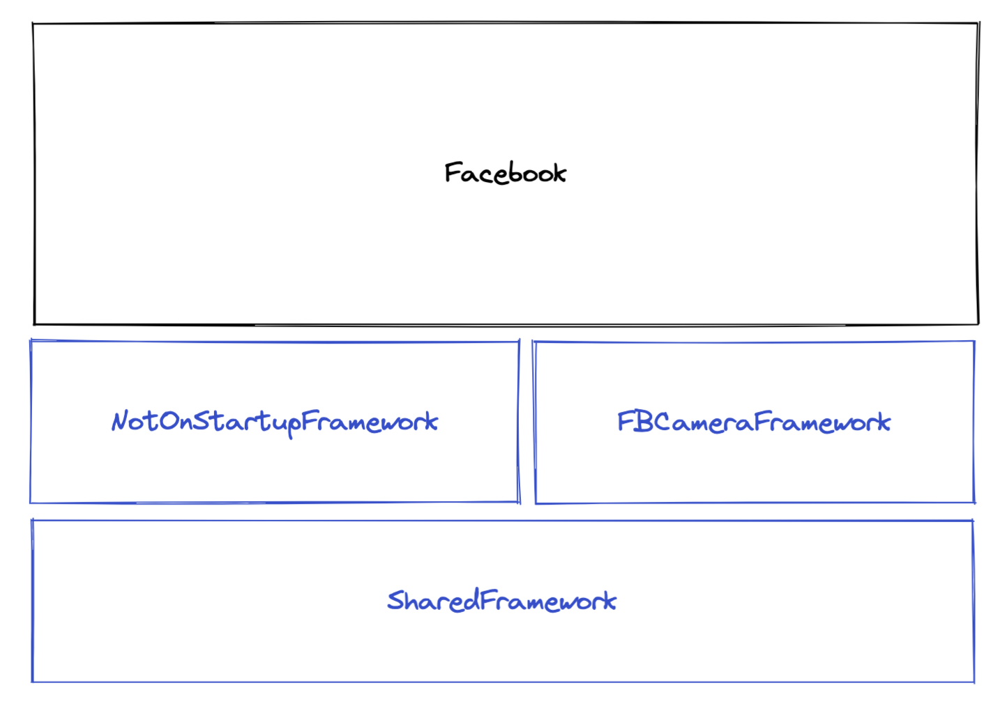
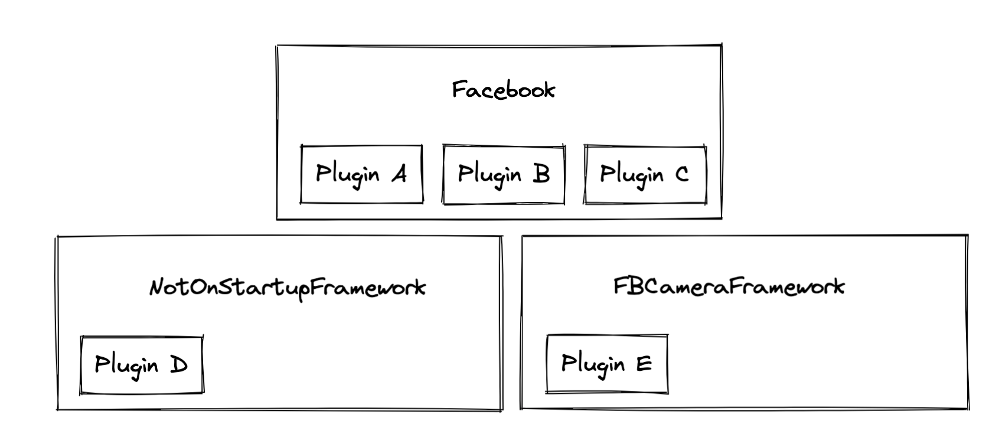
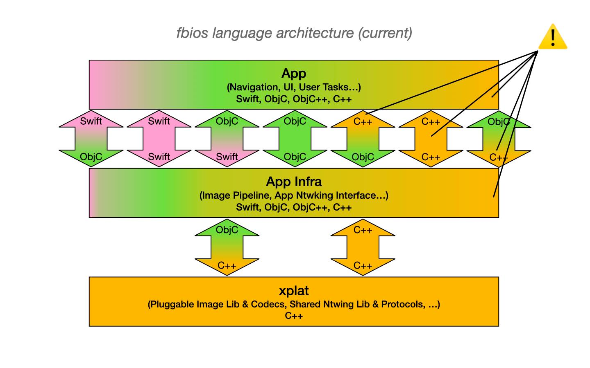
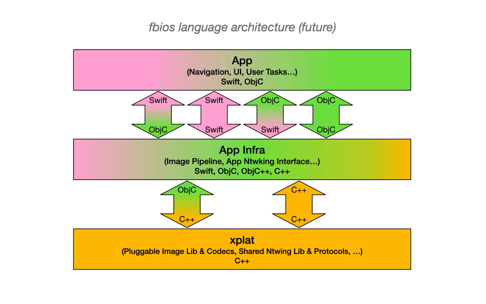

[Origin](https://engineering.fb.com/2023/02/06/ios/facebook-ios-app-architecture/)

# The evolution of Facebook’s iOS app architecture
## Introduction
After years of iteration, the Facebook codebase 
* Full of C++, Objective-C(++), and Swift.
* Dozens of dynamically loaded libraries (dylibs).
* Almost zero raw usage of Apple’s SDK — everything has been wrapped or replaced by an in-house abstraction.
* Makes heavy use of code generation, spurred by Buck
* Without heavy caching from build system, it would take an entire workday for the app to build.

## 2014: Establishing our own mobile frameworks
News Feed’s codebase had reliability issues.
* Data models were backed by __Core Data__:
    - Objects in Core Data are mutable
    - News Feed’s architecture is multithreaded.
    - To make matters worse, News Feed utilized bidirectional data flow, 
* New declarative UI and a new data model
    - [50 percent performance improvement](https://engineering.fb.com/2023/02/06/ios/facebook-ios-app-architecture/)
    - [ComponentKit](https://engineering.fb.com/2015/03/25/ios/introducing-componentkit-functional-and-declarative-ui-on-ios/) is still the de facto choice for building native UIs in Facebook
* This was a trade-off
    - New employees would have to shelve their industry knowledge of Apple APIs to learn the custom in-house infra. 

## 2015: An architectural inflection point
Startup performance was so slow (nearly 30 seconds!)
* Many contributing factors degraded startup performance.
* Focus only on the ones that had a long-term effect on the app’s architecture:
    - The app’s `pre-main` time
    - The app’s `module` system gave each product ungoverned access to all the app’s resourcing. 
    -
 
## 2016: Dylibs and modularity
* A number of operations have to be performed before an app’s `main` function can be called.
* Mitigate the unbounded growth of the app’s launch time
    - Move large swaths of product code into a lazily loaded container known as a dynamic library (dylib). 
    - It isn’t required to load before the app’s `main()` function.
    

    
* Engineers were required to wrap their code with a special function that could load a dylib if necessary
```objc
int main() {
  FBCallFunctionInDylib(
    NotOnStatupFramework,
    DoSomething,
    context
  );
}
```
* Quite a few code smells:
    - It was the reader’s responsibility to determine whether that dylib was used by the app the code was running in.
    - If the wrong dylib enum was used, the code would fail, but only at runtime
    
## 2017: Rethinking the FBiOS architecture
Meta’s open source build system, [Buck](https://buck.build/).
* Each `target` (app, dylib, library, etc.) is declared with some configuration
* Each `target` lists all information needed to build it (dependencies, compiler flags, sources, etc.)
* When `buck build` is called, it builds all this information into a graph that can be queried.
```
$ buck query “deps(:Facebook)”
> :NotOnStartup
> :FBCamera

$ buck query “attrfilter(labels, special_label, deps(:Facebook))”
> :NotOnStartup
```

## 2018: The proliferation of generated code
 * FBiOS was able to leverage Buck to query for information about code in the dependency
 * It could create a mapping of `function/classes -> dylibs` that could be generated on the fly.
 ```json
 {
  "functions": {
    "DoSomething": Dylib.NotOnStartup,
    ...
  },
  "classes": {
    "FBSomeClass": Dylib.SomeOtherOne
  }
}
```
* FBiOS used it to generate code that abstracted away the dylib enum from callsites
 ```objc
static std::unordered_map<const char *, Dylib> functionToDylib {{
  { "DoSomething", Dylib.NotOnStartup },
  { "FBSomeClass", Dylib.SomeOtherOne },
  ...
}};
 ```

* Because the code was regenerated based on local input
    - There was nothing to check in
    - There were no more merge conflicts.    
* `FBCallFunctionInDylib` no-longer required an app-specific dylib.
    - Instead, the call would read from static mapping generated for each application during build.


#### Moving signal to the left
* When FBiOS is built, Buck can produce a graph to show the location of all the plugins in the app:


* The plugin system can surface build-time errors for engineers to warn
    - "Plugin D, E could trigger a load of a dylib. This is not allowed, since the caller of these plugins lives in the app’s startup path."
    - "There is no plugin for rendering Profiles found in the app … this means that navigating to that screen will not work."
    - "There are two plugins for rendering Groups (Plugin A, Plugin B). One of them should be removed." 
* Now, when FBiOS is built successfully, it won’t fail because of:
    - Missing functionality
    - dylibs loading during app startup
    - Invariants in the module runtime system.    

#### The cost of code generation
* Migrating FBiOS to a plugin system 
    - Improved the app’s reliability
    - Provided faster signals to engineers
    - Made it possible for the app to trivially share code with other mobile apps
* It came at a cost
    - Plugin errors are not on Stack Overflow and can be confusing to debug.
    - A plugin system based on code generation and Buck is a far cry from traditional iOS development. 
    - Introduce a layer of indirection to the codebase. Where most apps would have a registry file with all features, these are generated in FBiOS and can be surprisingly difficult to find.    

## 2020: Swift and language architecture
* Historically, FBiOS had used C++ as a lever to build abstraction,
    - But C++ does not interop with Swift
* For most FBiOS APIs (like ComponentKit), some kind of shim would have to be created to use in Swift — creating code bloat.


    
* Began to form a language strategy about when and where various bits of code should be used:



* Product-facing APIs/code should not contain C++ 
    - Could freely use Swift and future Swift APIs from Apple.
    - Using plugins, FBiOS could abstract away C++ implementations
    
## 2022: The journey is 1 percent  finished
* FBiOS architecture has shifted quite a bit:
    - Countless in-house abstractions, like ComponentKit and GraphQL.
    - dylibs to keep `pre-main` times minimal
    - A plugin system (powered by `Buck`)
        - dylibs are abstracted away from engineers
        - code is easily shareable between apps.
    - Language guidelines 
        - About when and where various languages should be used 
        - Began to shift the codebase to reflect those language guidelines.

* Meanwhile, Apple has introduced exciting improvements to their phones, OS, and SDK:
    - New phones are fast
    - OS improvements make code loading even faster.
    - SwiftUI that shares a lot of concepts with ComponentKit.
    - Improved SDKs, as well as APIs
    
